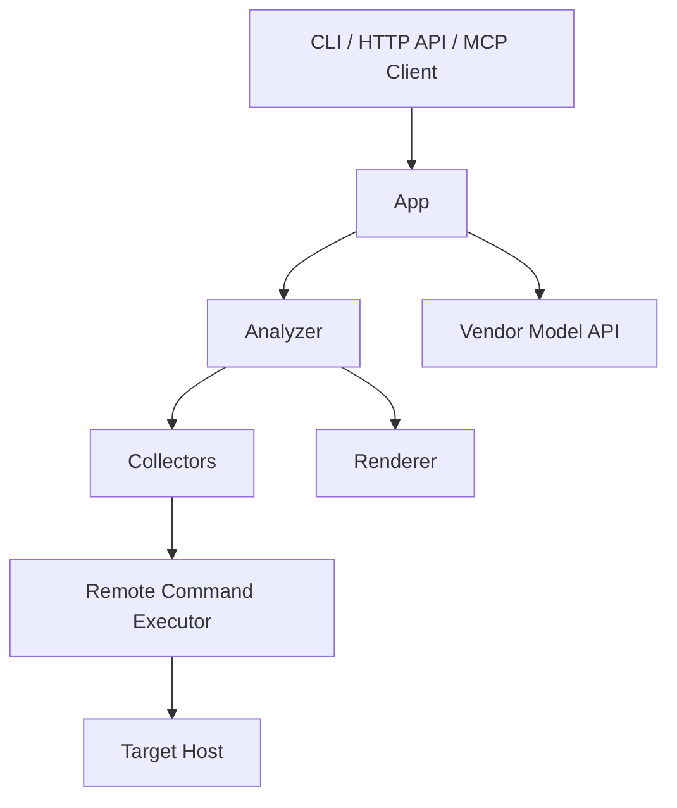

# FPE 总体设计

## 1. 目标

FPE 是一个基于厂商模型 API 的网络链路分析 AI 应用。

初版目标不是“完美诊断”，而是建立一套尽量简单、能快速落地的链路事实获取与结构化表达系统，覆盖：

1. 输入建模
2. 运行上下文识别
3. 网络对象信息采集
4. 链路骨架组织
5. 结构化输出
6. 为后续解释能力预留最少必要接口

## 2. 首版边界

初版必须做：

1. `PacketContext` 标准化
2. `ExecContext` 标准化
3. interface / rule / route / link / neighbor / OVS 基础信息获取
4. namespace / VRF 上下文切换
5. 链路骨架路径对象输出
6. MCP 工具接口
7. CLI / API / MCP 三种接入形态
8. 通过 SSH 采集远端目标机信息

初版不做：

1. `tcpdump` 抓包能力
2. `ovs-appctl ofproto/trace`
3. conntrack / NAT 动态分析
4. 自动修复
5. 复杂可视化

## 3. 简化后的系统分层



## 4. 模块职责

### 4.1 App

负责：

1. 请求接入
2. 参数校验
3. 调用 Analyzer
4. 响应封装

### 4.2 Analyzer

负责：

1. 组织一次分析流程
2. 调用各个采集函数
3. 维护简单状态
4. 汇总输出结果

### 4.3 Collectors

负责：

1. 采集 interface 信息
2. 采集 rule 信息
3. 采集 route 信息
4. 采集 link / neighbor / ovs 信息

### 4.4 Remote Command Executor

负责：

1. 通过 SSH 在远端执行命令，或通过 subprocess 在本地执行
2. 从环境变量读取 `FPE_HOST`、`FPE_NAMESPACE`、`FPE_VRF` 等，内部构建 `ExecContext`
3. 自动注入 `ip netns exec` 等上下文前缀
4. 返回原始结果给 collectors

### 4.5 Renderer

负责：

1. 输出 JSON 结构
2. 输出文本摘要
3. 为后续 AI 解释提供输入

## 5. 运行形态

### 5.1 CLI

适合本地研发和单机排查。

### 5.2 HTTP API

适合平台接入、UI 调用和自动化系统。

### 5.3 MCP Server

适合作为通用 AI 工具服务，被其他 Agent 或 MCP Client 调用。

MCP 需要支持两种完成形态：

1. `stdio` 模式
2. `SSE` 模式

其中 `SSE` 模式要求：

1. 支持通过 `POST` 建立连接或会话
2. 建连成功后再进入事件流传输
3. 不把“仅 `GET` 建立 SSE”作为唯一实现方式

## 6. 初版信息获取范围

必须获取：

1. 分析流量信息
2. namespace / VRF 上下文
3. interface 基础属性
4. `ip rule`
5. `ip route`
6. `ip link`
7. 邻居表
8. OVS 端口与 bridge 基础信息

可选获取：

1. firewall 基础规则列表
2. bridge FDB
3. VLAN 基础属性

## 7. 初版最小状态

1. `INIT`
2. `NORMALIZING_INPUT`
3. `RESOLVING_CONTEXT`
4. `COLLECTING`
5. `BUILDING_PATH`
6. `COMPLETED`
7. `INCOMPLETE`
8. `FAILED`

## 8. 首版设计原则

1. Tool-first
2. State-first
3. Read-only first
4. Structured output first
5. Honest unknowns
6. Replaceable adapters

## 8.1 开发环境约束

1. 必须使用宿主机的 `python3.12`
2. 必须使用 `venv` 创建项目虚拟环境
3. 不允许以系统全局 Python 直接安装项目依赖
4. 所有运行、测试和开发命令默认都在 `venv` 环境内执行

## 8.2 SSH 采集约束

1. 远端采集统一通过 SSH 方式执行
2. 目标主机 IP 或主机名通过环境变量配置
3. SSH 登录信息通过环境变量配置
4. 全程默认使用免密登录
5. 免密建立、密钥分发和权限准备不由程序参与
6. 程序不处理交互式密码输入

## 9. 设计取舍

初版不追求复杂模式堆叠，只保留最有价值的几条：

1. Collector 先集中在一个文件里，降低跳转成本
2. Analyzer 作为唯一主编排入口
3. Renderer 负责统一输出
4. Remote Executor 负责 SSH 和命令执行

如果后续复杂度上升，再补更重的模式，而不是一开始就拆得很散。

## 10. 首版推荐开发库

### 10.1 必选库

1. `pydantic`
2. `fastapi`
3. `typer`
4. `httpx`
5. `tenacity`
6. `pytest`
7. `python-dotenv`

### 10.2 标准库重点使用

1. `subprocess`
2. `dataclasses`
3. `enum`
4. `typing`
5. `ipaddress`
6. `json`
7. `re`
8. `pathlib`
9. `logging`
10. `asyncio`

### 10.3 增强库

1. `pyroute2`
2. `networkx`
3. `orjson`
4. `rich`
5. `uvicorn`

## 10.4 Python 版本要求

1. Python 版本固定为宿主机的 `python3.12`
2. `pyproject.toml` 中应显式声明 `requires-python = ">=3.12,<3.13"`
3. 本项目不以 `python3.11` 或更低版本为兼容目标

## 11. 首版运行方式

### 11.1 CLI

```bash
fpe analyze --src-ip 10.0.0.2 --dst-ip 8.8.8.8 --ingress-if lan0
```

> 目标主机通过环境变量 `FPE_HOST` 或 `FPE_TARGET_HOST` 指定，不通过 CLI 参数。

### 11.2 HTTP API

```http
POST /api/v1/analyze
```

### 11.3 MCP

MCP client 调用工具：

1. `fpe.analyze_flow`
2. `fpe.get_interface_context`
3. `fpe.get_rule`
4. `fpe.get_route`
5. `fpe.get_neighbor`
6. `fpe.get_ovs_bridges`
7. `fpe.get_ovs_flows`

传输形式：

1. `stdio`
2. `SSE`

`SSE` 模式要求支持 `POST` 建立连接。
