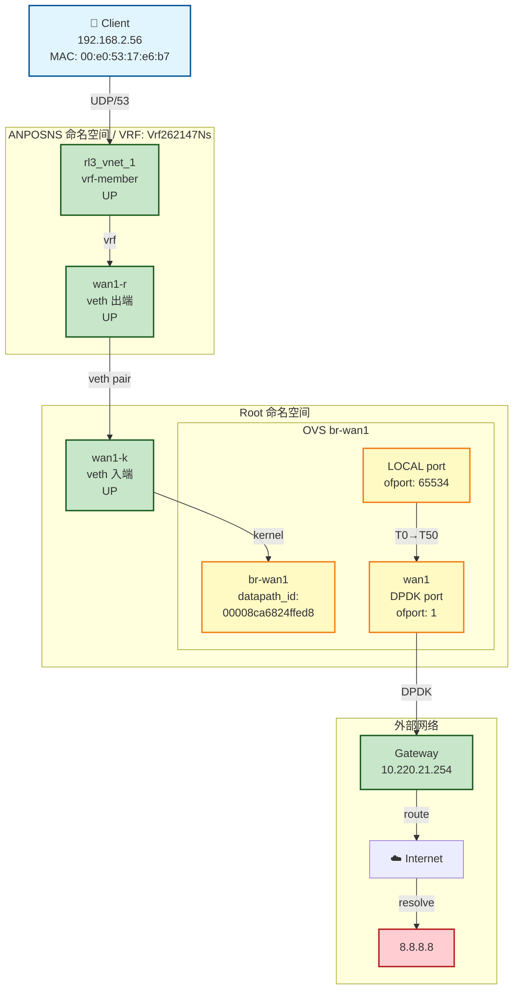
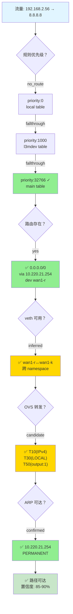

# 链路图 - 可视化版

## 完整路径流程图（详细）

```mermaid
graph TD
    START["🔵 源流量<br/>192.168.2.56<br/>UDP/53<br/>→ 8.8.8.8"]
    
    INGRESS["🟢 入接口<br/>rl3_vnet_1<br/>ANPOSNS/Vrf262147Ns<br/>状态: UP ✓<br/>vrf-member"]
    
    L3_INIT["🟡 VRF L3 路由查找"]
    
    RULE0["📋 规则:0 (local)<br/>查询 local 表<br/>结果: no_route<br/>fallthrough"]
    
    RULE1000["📋 规则:1000 (l3mdev)<br/>查询 l3mdev 表<br/>结果: no_route<br/>fallthrough"]
    
    RULE32766["🟢 规则:32766 (main)<br/>查询 main 表<br/>结果: route_found ✓<br/>TERMINATES"]
    
    ROUTE_LOOKUP["🟡 路由表查询<br/>表: main<br/>目标: 8.8.8.8"]
    
    ROUTE_FOUND["🟢 路由匹配<br/>前缀: 0.0.0.0/0<br/>下一跳: 10.220.21.254<br/>设备: wan1-r ✓"]
    
    VETH_SOURCE["🟡 跨 namespace 转移<br/>出端点: wan1-r<br/>命名空间: ANPOSNS<br/>状态: UP<br/>link_netnsid: 0"]
    
    VETH_TARGET["🟡 跨 namespace 转移<br/>入端点: wan1-k<br/>命名空间: root<br/>状态: 推断 UP"]
    
    L3_ROOT["🟡 Root NS L3 路由查找"]
    
    ROUTE_ROOT["🟢 Root NS 路由<br/>0.0.0.0/0 via 10.220.21.254<br/>dev: br-wan1 ✓"]
    
    OVS_INIT["🟡 OVS 流表分析<br/>桥接: br-wan1<br/>入口: LOCAL port<br/>Datapath ID: 00008ca6824ffed8"]
    
    OVS_T0["T0: 通配<br/>action: resubmit(,1)<br/>n_packets: 1,490,936"]
    
    OVS_T1_9["T1→T9: 通配链<br/>n_packets 递增<br/>→ 968,219"]
    
    OVS_T10["✅ T10: IPv4 分类<br/>match: ip<br/>action: set_queue:1000, resubmit(,19)<br/>n_packets: 652,317 ✓"]
    
    OVS_T19_26["T19→T26: 转发链<br/>NAT, stateful<br/>n_packets: 727,231"]
    
    OVS_T30["✅ T30: 入端口分类<br/>match: in_port=LOCAL<br/>action: load:0x1→reg11, resubmit(,50)<br/>n_packets: 664,059 ✓"]
    
    OVS_T50["✅ T50: 最终输出决策<br/>match: reg11=0x1<br/>action: output:1<br/>n_packets: 668,381 ✓"]
    
    PORT_OUTPUT["🟢 物理端口输出<br/>端口: wan1 (DPDK)<br/>port号: 1<br/>ofport: 1"]
    
    ARP_LOOKUP["🟡 ARP 查询<br/>IP: 10.220.21.254<br/>设备: br-wan1<br/>状态: PERMANENT ✓"]
    
    L2_FORWARD["🟢 L2 转发<br/>→ 10.220.21.254"]
    
    INTERNET["☁️ 互联网转发<br/>超出本机范围"]
    
    END["🔴 目标<br/>8.8.8.8"]
    
    START --> INGRESS
    INGRESS --> L3_INIT
    L3_INIT --> RULE0
    RULE0 --> RULE1000
    RULE1000 --> RULE32766
    RULE32766 --> ROUTE_LOOKUP
    ROUTE_LOOKUP --> ROUTE_FOUND
    ROUTE_FOUND --> VETH_SOURCE
    VETH_SOURCE --> VETH_TARGET
    VETH_TARGET --> L3_ROOT
    L3_ROOT --> ROUTE_ROOT
    ROUTE_ROOT --> OVS_INIT
    OVS_INIT --> OVS_T0
    OVS_T0 --> OVS_T1_9
    OVS_T1_9 --> OVS_T10
    OVS_T10 --> OVS_T19_26
    OVS_T19_26 --> OVS_T30
    OVS_T30 --> OVS_T50
    OVS_T50 --> PORT_OUTPUT
    PORT_OUTPUT --> ARP_LOOKUP
    ARP_LOOKUP --> L2_FORWARD
    L2_FORWARD --> INTERNET
    INTERNET --> END
    
    style START fill:#e1f5ff,stroke:#01579b,stroke-width:2px
    style INGRESS fill:#c8e6c9,stroke:#1b5e20,stroke-width:2px
    style RULE32766 fill:#c8e6c9,stroke:#1b5e20,stroke-width:2px
    style ROUTE_FOUND fill:#c8e6c9,stroke:#1b5e20,stroke-width:2px
    style OVS_T10 fill:#fff9c4,stroke:#f57f17,stroke-width:2px
    style OVS_T30 fill:#fff9c4,stroke:#f57f17,stroke-width:2px
    style OVS_T50 fill:#fff9c4,stroke:#f57f17,stroke-width:2px
    style PORT_OUTPUT fill:#c8e6c9,stroke:#1b5e20,stroke-width:2px
    style ARP_LOOKUP fill:#c8e6c9,stroke:#1b5e20,stroke-width:2px
    style L2_FORWARD fill:#c8e6c9,stroke:#1b5e20,stroke-width:2px
    style END fill:#ffcdd2,stroke:#b71c1c,stroke-width:2px
```

---

## 关键决策点高亮图

```mermaid
graph LR
    subgraph L3["📊 Kernel L3 层（VRF）"]
        direction LR
        RULE0["❌ local<br/>no_route"]
        RULE1000["❌ l3mdev<br/>no_route"]
        RULE32766["✅ main<br/>route_found"]
        ROUTE["0.0.0.0/0<br/>via wan1-r"]
        
        RULE0 -->|fallthrough| RULE1000
        RULE1000 -->|fallthrough| RULE32766
        RULE32766 -->|confirmed| ROUTE
    end
    
    subgraph VETH["🔀 跨 Namespace"]
        direction LR
        WAN1R["wan1-r<br/>ANPOSNS"]
        WAN1K["wan1-k<br/>root"]
        WAN1R -->|veth pair| WAN1K
    end
    
    subgraph OVS_TABLE["🌉 OVS 流表流水线"]
        direction LR
        T0["T0: 通配<br/>1.49M pkts"]
        T10["T10: IPv4 ✅<br/>652K pkts"]
        T30["T30: LOCAL ✅<br/>664K pkts"]
        T50["T50: output ✅<br/>668K pkts"]
        
        T0 -->|resubmit| T10
        T10 -->|resubmit| T30
        T30 -->|resubmit| T50
    end
    
    subgraph L2["📡 L2 转发"]
        direction LR
        PORT["wan1 port 1<br/>DPDK"]
        GW["Gateway<br/>10.220.21.254<br/>PERMANENT"]
        PORT -->|L2| GW
    end
    
    L3 -->|dev wan1-r| VETH
    VETH -->|kernel L3| OVS_TABLE
    OVS_TABLE -->|output:1| L2
    L2 -->|Internet| DST["8.8.8.8"]
    
    style RULE32766 fill:#90EE90,stroke:#228B22,stroke-width:3px
    style ROUTE fill:#90EE90,stroke:#228B22,stroke-width:3px
    style T10 fill:#FFD700,stroke:#FFA500,stroke-width:3px
    style T30 fill:#FFD700,stroke:#FFA500,stroke-width:3px
    style T50 fill:#FFD700,stroke:#FFA500,stroke-width:3px
    style GW fill:#90EE90,stroke:#228B22,stroke-width:3px
    style DST fill:#FF6B6B,stroke:#DC143C,stroke-width:3px
```

---

## 网络拓扑视图

```mermaid
graph TB
    CLIENT["📱 Client<br/>192.168.2.56<br/>MAC: 00:e0:53:17:e6:b7"]
    
    subgraph ANPOSNS_NS["ANPOSNS 命名空间 / VRF: Vrf262147Ns"]
        RL3["rl3_vnet_1<br/>vrf-member<br/>UP"]
        VETH_OUT["wan1-r<br/>veth 出端<br/>UP"]
        
        RL3 -->|vrf| VETH_OUT
    end
    
    subgraph ROOT_NS["Root 命名空间"]
        VETH_IN["wan1-k<br/>veth 入端<br/>UP"]
        
        subgraph OVS_BRIDGE["OVS br-wan1"]
            BRIDGE["br-wan1<br/>datapath_id:<br/>00008ca6824ffed8"]
            LOCAL["LOCAL port<br/>ofport: 65534"]
            WAN1["wan1<br/>DPDK port<br/>ofport: 1"]
            
            LOCAL -->|T0→T50| WAN1
        end
        
        VETH_IN -->|kernel| BRIDGE
    end
    
    subgraph EXTERNAL["外部网络"]
        GW["Gateway<br/>10.220.21.254"]
        INTERNET["☁️ Internet"]
        DST["8.8.8.8"]
        
        GW -->|route| INTERNET
        INTERNET -->|resolve| DST
    end
    
    CLIENT -->|UDP/53| RL3
    VETH_OUT -->|veth pair| VETH_IN
    WAN1 -->|DPDK| GW
    
    style CLIENT fill:#e1f5ff,stroke:#01579b,stroke-width:2px
    style RL3 fill:#c8e6c9,stroke:#1b5e20,stroke-width:2px
    style VETH_OUT fill:#c8e6c9,stroke:#1b5e20,stroke-width:2px
    style VETH_IN fill:#c8e6c9,stroke:#1b5e20,stroke-width:2px
    style BRIDGE fill:#fff9c4,stroke:#f57f17,stroke-width:2px
    style LOCAL fill:#fff9c4,stroke:#f57f17,stroke-width:2px
    style WAN1 fill:#fff9c4,stroke:#f57f17,stroke-width:2px
    style GW fill:#c8e6c9,stroke:#1b5e20,stroke-width:2px
    style DST fill:#ffcdd2,stroke:#b71c1c,stroke-width:2px
```

---

## 流量计数器追踪

```mermaid
graph LR
    IN["Ingress<br/>rl3_vnet_1"]
    
    T0["T0<br/>1,490,936"]
    T1["T1<br/>890,399"]
    T2["T2<br/>1,490,935"]
    T3["T3<br/>669,985"]
    T9["T9<br/>968,219"]
    T10["T10<br/>652,317 ✅"]
    T19["T19<br/>727,249"]
    T20["T20<br/>727,249"]
    T25["T25<br/>727,249"]
    T26["T26<br/>727,231"]
    T30["T30<br/>664,059 ✅"]
    T50["T50<br/>668,381 ✅"]
    
    OUT["Output<br/>wan1"]
    
    IN --> T0
    T0 --> T1
    T1 --> T2
    T2 --> T3
    T3 --> T9
    T9 --> T10
    T10 --> T19
    T19 --> T20
    T20 --> T25
    T25 --> T26
    T26 --> T30
    T30 --> T50
    T50 --> OUT
    
    style IN fill:#e1f5ff
    style T10 fill:#FFD700
    style T30 fill:#FFD700
    style T50 fill:#FFD700
    style OUT fill:#90EE90
    
    linkStyle default stroke:#666,stroke-width:2px
```

---

## 转发决策树

```mermaid
graph TD
    START["流量: 192.168.2.56 → 8.8.8.8"]
    
    Q1{"规则优先级？"}
    
    R0["priority:0<br/>local table"]
    R1000["priority:1000<br/>l3mdev table"]
    R32766["priority:32766 ✓<br/>main table"]
    
    ROUTE_OK{"路由存在？"}
    YES_ROUTE["✅ 0.0.0.0/0<br/>via 10.220.21.254<br/>dev wan1-r"]
    
    NS_OK{"veth 可用？"}
    YES_NS["✅ wan1-r↔wan1-k<br/>跨 namespace"]
    
    OVS_OK{"OVS 转发？"}
    YES_OVS["✅ T10(IPv4)<br/>T30(LOCAL)<br/>T50(output:1)"]
    
    ARP_OK{"ARP 可达？"}
    YES_ARP["✅ 10.220.21.254<br/>PERMANENT"]
    
    RESULT["✅ 路径可达<br/>置信度: 85-90%"]
    
    START --> Q1
    Q1 -->|no_route| R0
    R0 -->|fallthrough| R1000
    R1000 -->|fallthrough| R32766
    R32766 --> ROUTE_OK
    ROUTE_OK -->|yes| YES_ROUTE
    YES_ROUTE --> NS_OK
    NS_OK -->|inferred| YES_NS
    YES_NS --> OVS_OK
    OVS_OK -->|candidate| YES_OVS
    YES_OVS --> ARP_OK
    ARP_OK -->|confirmed| YES_ARP
    YES_ARP --> RESULT
    
    style START fill:#e1f5ff
    style R32766 fill:#90EE90
    style YES_ROUTE fill:#90EE90
    style YES_NS fill:#FFD700
    style YES_OVS fill:#FFD700
    style YES_ARP fill:#90EE90
    style RESULT fill:#c8e6c9
```

---

**图表生成**：2026-05-26  
**可视化工具**：Mermaid v11  
**数据源**：FPE MCP 工具实时分析
