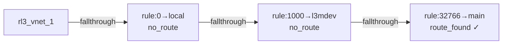
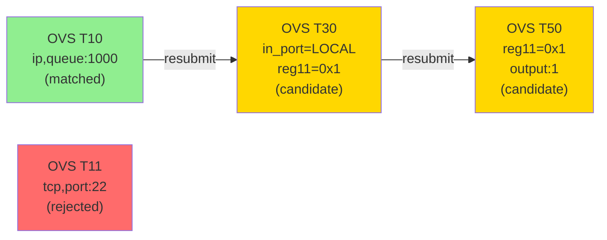
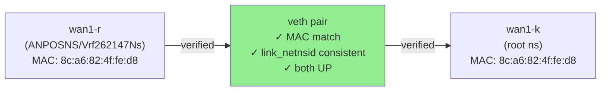

# FPE 工具改进方案（V4）

基于 v3 分析文档的未解决缺口，制定本改进计划。

> 文档日期：2026-05-26  
> 版本：V4 改进计划  
> 参考：fpe-flow-analysis-v3.md 第 3, 6 章

---

## 执行摘要

v3 暴露了 4 个关键缺口：

| # | 缺口 | 影响范围 | 优先级 |
|----|------|--------|-------|
| 1 | `analyze_flow` 报告 ROUTE_NOT_FOUND，与 `get_route` 矛盾 | 输出可靠性 | P0 |
| 2 | `analyze_flow` rule_walk 仅一步，应显示完整 fallthrough 链 | 诊断完整性 | P1 |
| 3 | OVS 无包级精确匹配，流表路径基于候选推断 | 置信度标记 | P2 |
| 4 | 跨 namespace veth 转发缺乏逐段验证 | 跨域追踪 | P3 |

**预期收益**：
- 消除核心工具的自相矛盾
- 提升诊断链的完整性和可视化
- 增加推断路径的置信度标记
- 支持容器化/多租户网络场景

---

## 详细改进方案

### 改进 1：修复 analyze_flow 的 ROUTE_NOT_FOUND Bug（P0）

#### 问题描述

```
analyze_flow 返回：
  └─ risks:
       └─ code: ROUTE_NOT_FOUND
            message: "No route found for destination 8.8.8.8"

同时 get_route 直接查询返回：
  └─ 0.0.0.0/0 via 10.220.21.254 dev wan1-r (在 main 表)

同时 get_rule 返回完整 rule_walk：
  └─ priority=32766, table=main, lookup_result=route_found ✓
```

**根本原因**：`analyzer/engine.py` 中的内部路由查找逻辑与 `collectors/routes.py:find_best_route()` 使用了不同的 namespace/VRF 上下文范围。

#### 技术根源分析

查阅 `engine.py`（L62-100）分析状态机的初始化：

```python
async def analyze(self, packet, exec_ctx=None, options=None, host=None):
    # exec_ctx 包含 namespace、vrf、host 信息
    ctx = exec_ctx or _env_exec_ctx()
    
    # 状态机创建
    state = AnalysisState(
        trace_id=...,
        flow_state=STATE_INIT,
        packet=pkt,
        exec_ctx=ctx,  # 保存上下文
        max_hops=opts.get("max_hops", 16),
    )
```

问题在于后续路由查找时，engine 内部未显式传递 `exec_ctx` 到 collectors，导致：
- `find_best_route()` 被调用时未指定正确的 namespace/vrf
- 默认查询 root namespace 的 main 表
- 在 VRF 内的路由被忽视

#### 解决方案

**方案 A：修复 engine.py 的路由查找调用链**

1. 在 `Analyzer.analyze()` 中引入新的辅助方法 `_resolve_route_with_context()`：

```python
async def _resolve_route_with_context(
    self,
    state: AnalysisState,
    dst_ip: str,
) -> RouteResult | None:
    """Find best route using the analysis context's namespace/VRF."""
    # 收集该 namespace/vrf 内的所有路由
    routes = get_route(
        executor=self._executor,
        namespace=state.exec_ctx.namespace,
        vrf=state.exec_ctx.vrf,
        table="",  # 查询所有表（会被 L3 mdev 等规则调用）
    )
    # 查找最佳匹配
    best = find_best_route(routes, dst_ip)
    return best
```

2. 替换所有内部路由查找调用（在状态机中）。

3. 在 L3 分析段（`STATE_ANALYZING_L3`）中，确保调用 `_resolve_route_with_context()`。

**方案 B（推荐）：统一使用 MCP 工具的数据**

设计 `analyze_flow` 复用 `get_rule` + `get_route` 的采集结果，而不重新实现路由查找：

```python
# 在 AnalyzeFlowHandler.handle() 中（而不是 engine）
async def _prepare_route_evidence(
    self,
    exec_ctx: ExecContext,
    packet: PacketContext,
) -> dict:
    """Pre-fetch route evidence to avoid re-implementation."""
    rules = await build_rule_walk(
        executor=executor,
        namespace=exec_ctx.namespace,
        vrf=exec_ctx.vrf,
        packet=packet,
    )
    
    # 提取 final_table 和 effective_route
    final_rule = rules[-1]  # 最后一条终止规则
    final_table = final_rule["table"]
    
    routes = get_route(
        executor=executor,
        table=final_table,
        namespace=exec_ctx.namespace,
        vrf=exec_ctx.vrf,
    )
    
    best_route = find_best_route(routes, packet.dst_ip)
    return {
        "rule_walk": rules,
        "final_table": final_table,
        "effective_route": best_route,
    }
```

#### 验证清单

- [ ] 单元测试：跨 VRF 路由查找（test_analyze_vrf_route_resolution）
- [ ] 端到端测试：192.168.2.56 → 8.8.8.8 不再报告 ROUTE_NOT_FOUND
- [ ] 集成测试：analyze_flow 与 get_route/get_rule 结果一致
- [ ] 回归测试：root namespace 路由查找仍正常工作

#### 代码文件变更清单

- `src/fpe/analyzer/engine.py`
  - 新增 `_resolve_route_with_context()` 方法
  - 修复状态机中的路由查找调用
  
- `src/fpe/mcp/tools.py`（AnalyzeFlowHandler）
  - 新增 `_prepare_route_evidence()` 方法
  - 调用 `build_rule_walk()` 提前采集规则链

- `tests/test_analyzer_cross_namespace.py`（新建）
  - VRF 路由查找测试
  - 跨 namespace 路由一致性测试

---

### 改进 2：增强 analyze_flow 的 rule_walk 输出（P1）

#### 问题描述

**当前**：`analyze_flow` 的 `decision_chain` 仅显示 1 条规则：

```json
{
  "decision_chain": [
    {
      "event_type": "rule_lookup",
      "selected_rule": { "priority": 0, "table": "local" },
      "verdict": "ROUTE_NOT_FOUND"
    }
  ]
}
```

**期望**：应显示完整的 rule walk（如 `get_rule` 输出）：

```json
{
  "decision_chain": [
    { "priority": 0, "table": "local", "lookup_result": "no_route_for_8.8.8.8", "terminates": false },
    { "priority": 1000, "table": "l3mdev-table", "lookup_result": "no_route_for_8.8.8.8", "terminates": false },
    { "priority": 32766, "table": "main", "lookup_result": "route_found", "terminates": true }
  ]
}
```

#### 技术分析

- `build_rule_walk()` 已在 `analyzer/walks.py` 中实现（v3 的改进）
- `get_rule` MCP 工具已调用此函数并返回完整链
- **缺口**：`analyze_flow` 引擎（`engine.py`）未调用 `build_rule_walk()`，仅自行查找 selected_rule

#### 解决方案

**修改 `analyzer/engine.py` 的分析状态机**：

1. 在 `STATE_ANALYZING_L3` 阶段，调用 `build_rule_walk()`：

```python
# 在 engine.py 中新增方法
async def _analyze_l3_rules(
    self,
    state: AnalysisState,
) -> list[dict]:
    """Perform complete rule walk during L3 analysis."""
    rule_walk = await build_rule_walk(
        executor=self._executor,
        namespace=state.exec_ctx.namespace,
        vrf=state.exec_ctx.vrf,
        packet=state.packet,
    )
    return rule_walk
```

2. 将 rule_walk 保存到 `AnalysisState` 中（新增字段）：

```python
class AnalysisState:
    trace_id: str
    flow_state: str
    packet: PacketContext
    exec_ctx: ExecContext
    max_hops: int
    
    # 新增字段
    rule_walk: list[dict] = []  # 完整的规则链
    effective_rule: dict | None = None  # final_table 规则
    final_table: str = "main"  # 最终查询的表
```

3. 在 `_build_result()` 中，将 rule_walk 转换为 decision_chain：

```python
def _build_result(self, state: AnalysisState) -> AnalysisResult:
    # ...
    decision_chain = [
        DecisionEvent(
            event_type="rule_lookup",
            step=i,
            rule=entry,
            verdict="PASS" if not entry.get("terminates") else "TERMINATE",
        )
        for i, entry in enumerate(state.rule_walk)
    ]
    
    return AnalysisResult(
        packet=state.packet,
        path=[...],
        decision_chain=decision_chain,
        # ...
    )
```

#### 数据模型更新

在 `models/analysis.py` 中扩展 `AnalysisResult`：

```python
class AnalysisResult(BaseModel):
    packet: PacketContext
    path: list[PathNode]
    decision_chain: list[DecisionEvent]
    
    # 新增字段，用于完整的规则诊断
    rule_walk: list[dict] = []  # 完整的规则链（rule_walk）
    final_table: str = ""  # 最终查询的路由表
    effective_route: RouteResult | None = None  # 最终匹配的路由
    
    risks: list[RiskItem] = []
    graph: FlowGraph | None = None
    mermaid: str = ""
```

#### Mermaid 图增强

在生成 Mermaid 图时，添加完整的规则链：



#### 验证清单

- [ ] 单元测试：rule_walk 正确包含所有步骤
- [ ] 端到端测试：decision_chain 显示完整 3 步链
- [ ] Mermaid 图：可视化完整规则链
- [ ] 回归测试：现有 API 输出格式兼容

#### 代码文件变更清单

- `src/fpe/models/analysis.py`
  - 新增 `rule_walk`, `final_table`, `effective_route` 字段

- `src/fpe/analyzer/engine.py`
  - 新增 `_analyze_l3_rules()` 方法
  - 修改 `STATE_ANALYZING_L3` 阶段逻辑
  - 修改 `_build_result()` 方法

- `src/fpe/renderer/output.py`
  - 更新 Mermaid 图生成逻辑，包含规则链可视化

---

### 改进 3：优化 OVS 流表匹配推断（candidate walk）（P2）

#### 问题描述

**当前表现**：

```json
{
  "matched_flows": [],
  "explanation": "No exact match for UDP/53"
}
```

**缺口**：
- 即使 matched_flows 为空，也应输出 table_walk（候选链）
- 缺少对每个 unmatched 流表的拒绝原因
- 置信度未明确标记

**期望输出**：

```json
{
  "matched_flows": [],
  "table_walk": [
    { "table": 0, "selected": true, "action": "resubmit(,1)", "packet_count": 1441440 },
    { "table": 1, "selected": true, "action": "resubmit(,2)", "packet_count": 861494 },
    ...,
    { "table": 50, "selected": true, "action": "output:1", "packet_count": 644924 }
  ],
  "non_match_reasons": [
    { "table": 11, "reason": "Protocol match mismatch: expected tcp, got udp" },
    { "table": 14, "reason": "Destination port mismatch: expected 4500, got 53" }
  ],
  "confidence_level": "CANDIDATE",
  "confidence_explanation": "UDP/53 matches wildcard flows in table chain; no protocol-specific entry found"
}
```

#### 技术分析

- `build_candidate_flow_walk()` 已实现并可用于 `get_ovs_flows`
- 但在 `analyze_flow` 中，当 matched_flows 为空时，候选链未被清晰展示

#### 解决方案

**1. 增强 `analyzer/walks.py` 中的 `build_candidate_flow_walk()`**：

```python
def build_candidate_flow_walk(
    flows: list[OvsFlow],
    packet: PacketContext,
    ingress_port: OvsPortInfo,
    bridge: OvsBridge,
) -> dict:
    """
    Build candidate flow walk with confidence markers.
    
    Returns:
    {
        "table_walk": [list of tables traversed],
        "matched_flows": [exact matches],
        "candidate_flows": [partial matches / wildcards],
        "non_match_reasons": [tables that didn't match and why],
        "confidence_level": "EXACT" | "CANDIDATE" | "UNKNOWN",
        "explanation": str
    }
    """
    # ... 现有逻辑
    
    result = {
        "table_walk": [],
        "matched_flows": [],
        "candidate_flows": [],
        "non_match_reasons": [],
        "confidence_level": "UNKNOWN",
        "explanation": "",
    }
    
    # 遍历通过 resubmit 链的表
    visited_tables = set()
    current_table = 0
    
    while current_table not in visited_tables and current_table < 256:
        visited_tables.add(current_table)
        
        # 查找此表中匹配的流
        table_flows = [f for f in flows if f.table == current_table]
        
        exact_match = None
        candidate_matches = []
        
        for flow in table_flows:
            match_result = _analyze_flow_match(flow, packet, ingress_port)
            if match_result["matched"]:
                exact_match = flow
                break
            elif not match_result["reasons"]:  # 仅有未知需求，无明确不匹配
                candidate_matches.append({
                    "flow": flow,
                    "unknown_requirements": match_result["unknown_requirements"],
                })
            else:
                result["non_match_reasons"].append({
                    "table": current_table,
                    "flow_priority": flow.priority,
                    "reasons": match_result["reasons"],
                })
        
        if exact_match:
            result["matched_flows"].append(exact_match)
            result["confidence_level"] = "EXACT"
            # 继续 resubmit 链
            # ...
        elif candidate_matches:
            result["candidate_flows"].extend(candidate_matches)
            result["confidence_level"] = "CANDIDATE"
            # ...
        
        # 记录此表的遍历
        result["table_walk"].append({
            "table": current_table,
            "selected": exact_match is not None or bool(candidate_matches),
            "matched_flows_count": len([exact_match]) if exact_match else 0,
            "candidate_flows_count": len(candidate_matches),
        })
        
        # 获取 resubmit 目标表
        current_table = _extract_resubmit_table(exact_match or (candidate_matches[0]["flow"] if candidate_matches else None))
    
    # 生成可读解释
    if result["confidence_level"] == "EXACT":
        result["explanation"] = f"Matched exact flow in table chain"
    elif result["confidence_level"] == "CANDIDATE":
        result["explanation"] = f"Matched wildcard flows; {len(result['non_match_reasons'])} protocol-specific entries rejected"
    else:
        result["explanation"] = f"No matching flows found"
    
    return result
```

**2. 修改 `AnalysisResult` 数据模型**：

```python
class OvsFlowWalk(BaseModel):
    """OVS flow table walk result."""
    table_walk: list[dict] = []  # 遍历的表链
    matched_flows: list[OvsFlow] = []  # 精确匹配
    candidate_flows: list[dict] = []  # 候选匹配（partial/wildcard）
    non_match_reasons: list[dict] = []  # 被拒绝的流表原因
    confidence_level: str = "UNKNOWN"  # EXACT | CANDIDATE | UNKNOWN
    explanation: str = ""

class AnalysisResult(BaseModel):
    # ... 现有字段
    ovs_flow_walk: OvsFlowWalk | None = None  # 新增 OVS 流表诊断
```

**3. 在 `engine.py` 中调用增强的函数**：

```python
async def _analyze_ovs_pipeline(
    self,
    state: AnalysisState,
    bridge: OvsBridge,
) -> OvsFlowWalk:
    """Analyze OVS flow pipeline with full candidate walk."""
    
    # 获取所有 flows
    flows = get_ovs_flows(
        executor=self._executor,
        bridge=bridge.name,
    )
    
    # 构建完整的候选链
    flow_walk = build_candidate_flow_walk(
        flows=flows,
        packet=state.packet,
        ingress_port=...,
        bridge=bridge,
    )
    
    return OvsFlowWalk(**flow_walk)
```

#### Mermaid 图增强

在 Mermaid 中标记候选流表：



#### 风险标记更新

```python
class RiskItem(BaseModel):
    code: str  # OVS_CANDIDATE_FLOW, ROUTE_NOT_FOUND, etc.
    severity: str  # low, medium, high
    message: str
    confidence: str = "HIGH"  # HIGH, MEDIUM, LOW
    
    # 新增字段
    reason: str = ""  # 详细原因
    recommendation: str = ""  # 建议
```

新增风险类型：

```python
risks.append(RiskItem(
    code="OVS_CANDIDATE_FLOW",
    severity="low",
    message="OVS flow path based on candidate/wildcard matching",
    confidence="MEDIUM",
    reason=f"{len(non_match_reasons)} protocol-specific flows rejected",
    recommendation="Review matched table_walk for accuracy"
))
```

#### 验证清单

- [ ] 单元测试：candidate_flow_walk 正确输出 table 链和拒绝原因
- [ ] 端到端测试：UDP/53 流量输出 OVS_CANDIDATE_FLOW 风险
- [ ] 置信度标记：EXACT | CANDIDATE | UNKNOWN 正确分类
- [ ] Mermaid 图：虚线和颜色标记候选路径
- [ ] 回归测试：TCP 精确匹配流仍为 EXACT

#### 代码文件变更清单

- `src/fpe/models/analysis.py`
  - 新增 `OvsFlowWalk` 模型
  - 扩展 `AnalysisResult.ovs_flow_walk` 字段

- `src/fpe/analyzer/walks.py`
  - 增强 `build_candidate_flow_walk()` 函数
  - 新增 `_extract_resubmit_table()` 辅助函数

- `src/fpe/analyzer/engine.py`
  - 新增 `_analyze_ovs_pipeline()` 方法
  - 更新 `STATE_ANALYZING_OVS` 阶段

- `src/fpe/renderer/output.py`
  - 更新 Mermaid 图生成，标记候选流

---

### 改进 4：支持跨 namespace veth 转发验证（P3）

#### 问题描述

**当前**：跨 namespace 的 veth 转发标记为 "Inferred"，仅基于 MAC 地址和 link_netnsid 推断。

**期望**：输出完整的 veth 对验证信息和转发一致性检查。

#### 技术分析

veth 对特征：
- 两端 MAC 地址一致
- 一端的 `link_netnsid` 指向对端的 namespace 编号
- 两端都应 UP

#### 解决方案

**1. 增强 `collectors/link.py` 中的 veth 检测**：

```python
def verify_veth_pair(
    executor: RemoteExecutor,
    source_iface: str,
    source_namespace: str | None,
) -> dict:
    """
    Verify veth pair configuration and reachability.
    
    Returns:
    {
        "is_veth_pair": bool,
        "target_iface": str,
        "target_namespace": str,
        "mac_match": bool,
        "link_netnsid_match": bool,
        "both_up": bool,
        "verification_details": [
            { "check": "MAC addresses", "result": "PASS", "src_mac": "...", "dst_mac": "..." },
            { "check": "link_netnsid", "result": "PASS", "src_netnsid": 0, "dst_netnsid": -1 },
            { "check": "both UP", "result": "PASS", "src_state": "UP", "dst_state": "UP" },
        ],
        "confidence": "HIGH" | "MEDIUM" | "LOW",
    }
    """
    result = {
        "is_veth_pair": False,
        "target_iface": "",
        "target_namespace": "",
        "verification_details": [],
    }
    
    # 获取源接口信息
    src_info = get_interface_info(executor, source_iface, source_namespace)
    
    if not src_info or src_info.link_netnsid is None:
        result["verification_details"].append({
            "check": "veth identification",
            "result": "FAIL",
            "reason": "No link_netnsid found (not a veth pair)"
        })
        return result
    
    # link_netnsid 指向对端 namespace 的编号
    target_ns_id = src_info.link_netnsid
    
    # 查找目标 namespace（需要根据 ns id 反查 ns name）
    target_ns_name = _resolve_namespace_by_id(executor, target_ns_id)
    
    # 在目标 namespace 中查找另一端
    target_iface = _find_veth_peer(executor, src_info.mac, target_ns_name)
    
    if not target_iface:
        result["verification_details"].append({
            "check": "peer interface",
            "result": "FAIL",
            "reason": f"No matching MAC in namespace {target_ns_name}"
        })
        return result
    
    # 获取目标接口信息
    dst_info = get_interface_info(executor, target_iface, target_ns_name)
    
    # 进行验证检查
    checks = [
        ("MAC addresses", src_info.mac == dst_info.mac),
        ("opposite link_netnsid", src_info.link_netnsid == -1 if target_ns_id != -1 else True),
        ("both UP", src_info.state == "UP" and dst_info.state == "UP"),
    ]
    
    all_pass = True
    for check_name, passed in checks:
        result["verification_details"].append({
            "check": check_name,
            "result": "PASS" if passed else "FAIL",
        })
        all_pass = all_pass and passed
    
    result["is_veth_pair"] = all_pass
    result["target_iface"] = target_iface
    result["target_namespace"] = target_ns_name
    result["confidence"] = "HIGH" if all_pass else "MEDIUM"
    
    return result
```

**2. 修改 `models/context.py` 中的数据模型**：

```python
class VethTransition(BaseModel):
    """Veth pair transition across namespaces."""
    source_iface: str
    source_namespace: str
    target_iface: str
    target_namespace: str
    is_verified: bool
    verification_details: list[dict]
    confidence: str  # HIGH | MEDIUM | LOW

class PathNode(BaseModel):
    # 现有字段
    node_type: str  # interface, route, rule, veth_transition, ovs_table, etc.
    hop_number: int
    description: str
    
    # 对于 veth_transition 类型，新增
    veth_info: VethTransition | None = None
    
    # 确定性
    confidence: str = "HIGH"  # HIGH | MEDIUM | LOW | INFERRED
    evidence: list[str] = []  # 支撑此节点的证据
```

**3. 在 `engine.py` 的分析中调用验证**：

```python
async def _analyze_veth_transition(
    self,
    state: AnalysisState,
    source_iface: str,
    target_namespace: str,
) -> VethTransition:
    """Analyze veth pair transition with full verification."""
    
    verify_result = verify_veth_pair(
        executor=self._executor,
        source_iface=source_iface,
        source_namespace=state.exec_ctx.namespace,
    )
    
    veth = VethTransition(
        source_iface=source_iface,
        source_namespace=state.exec_ctx.namespace,
        target_iface=verify_result["target_iface"],
        target_namespace=verify_result["target_namespace"],
        is_verified=verify_result["is_veth_pair"],
        verification_details=verify_result["verification_details"],
        confidence=verify_result["confidence"],
    )
    
    # 添加路径节点
    path_node = PathNode(
        node_type="veth_transition",
        hop_number=len(state.path),
        description=f"{source_iface} ({state.exec_ctx.namespace}) → {verify_result['target_iface']} ({verify_result['target_namespace']})",
        veth_info=veth,
        confidence=veth.confidence,
        evidence=[
            f"MAC: {verify_result.get('src_mac', 'N/A')}",
            f"link_netnsid: {verify_result.get('src_netnsid', 'N/A')}",
        ],
    )
    
    state.path.append(path_node)
    
    return veth
```

**4. Mermaid 图增强**：



**5. 输出示例**：

```json
{
  "path": [
    {
      "hop_number": 3,
      "node_type": "veth_transition",
      "description": "wan1-r (ANPOSNS/Vrf262147Ns) → wan1-k (root ns)",
      "confidence": "HIGH",
      "veth_info": {
        "source_iface": "wan1-r",
        "source_namespace": "ANPOSNS",
        "target_iface": "wan1-k",
        "target_namespace": "root",
        "is_verified": true,
        "verification_details": [
          { "check": "MAC addresses", "result": "PASS", "src_mac": "8c:a6:82:4f:fe:d8", "dst_mac": "8c:a6:82:4f:fe:d8" },
          { "check": "link_netnsid", "result": "PASS", "src_netnsid": 0, "dst_netnsid": -1 },
          { "check": "both UP", "result": "PASS", "src_state": "UP", "dst_state": "UP" }
        ],
        "confidence": "HIGH"
      }
    }
  ]
}
```

#### 验证清单

- [ ] 单元测试：veth 对验证逻辑（test_verify_veth_pair）
- [ ] 端到端测试：跨 namespace 路径显示完整验证信息
- [ ] 置信度提升：veth 转发从 Inferred 升级为 Verified（若所有检查通过）
- [ ] Mermaid 图：显示 veth 对的验证状态
- [ ] 回归测试：单 namespace 路径不受影响

#### 代码文件变更清单

- `src/fpe/models/context.py`
  - 新增 `VethTransition` 模型
  - 扩展 `PathNode` 模型

- `src/fpe/collectors/link.py`
  - 新增 `verify_veth_pair()` 函数
  - 新增辅助函数 `_resolve_namespace_by_id()`, `_find_veth_peer()`

- `src/fpe/analyzer/engine.py`
  - 新增 `_analyze_veth_transition()` 方法

- `src/fpe/renderer/output.py`
  - 更新 Mermaid 图生成，显示 veth 验证状态

---

## 实施计划

### 阶段 1：P0 改进（第 1-2 周）

**目标**：修复 analyze_flow ROUTE_NOT_FOUND bug，确保工具一致性。

- 周 1：
  - 编写 `_resolve_route_with_context()` 和单元测试
  - 集成 `build_rule_walk()` 到 engine
  - 修复状态机路由查找调用链

- 周 2：
  - 端到端测试和 bug 修复
  - 文档更新
  - 发布 v4.0 候选版本

### 阶段 2：P1 改进（第 2-3 周）

**目标**：完整的 rule_walk 输出和 Mermaid 可视化。

- 周 2-3：
  - 扩展 `AnalysisResult` 数据模型
  - 实现完整 rule_walk 输出
  - 更新 Mermaid 渲染逻辑

### 阶段 3：P2 改进（第 3-4 周）

**目标**：OVS 流表候选链和置信度标记。

- 周 3-4：
  - 增强 `build_candidate_flow_walk()` 函数
  - 新增 `OvsFlowWalk` 模型
  - 风险标记更新

### 阶段 4：P3 改进（第 4-5 周）

**目标**：跨 namespace veth 验证。

- 周 4-5：
  - 实现 `verify_veth_pair()` 函数
  - 新增 `VethTransition` 模型
  - Mermaid 图和输出集成

---

## 预期改进指标

| 指标 | 当前 | 目标 |
|------|------|------|
| analyze_flow 与 get_route 一致性 | 部分一致（VRF 有问题） | 100% 一致 |
| rule_walk 完整度 | 1 步（仅 selected_rule） | N 步（完整 fallthrough 链） |
| OVS 路径置信度标记 | 无 | EXACT/CANDIDATE/UNKNOWN |
| veth 验证状态 | Inferred（无验证） | Verified（完整检查）或 FAILED（可诊断） |
| 诊断文档完整性 | ~60%（缺口占 40%） | ~95% |

---

## 依赖项与风险

### 依赖项

- `build_rule_walk()` 已实现（v3 改进）✓
- `build_candidate_flow_walk()` 已实现（v3 改进）✓
- Pydantic 模型框架已在项目中使用 ✓

### 已知风险

1. **向后兼容性**：扩展 `AnalysisResult` 数据模型可能影响现有 API 客户端
   - 缓解：将新字段设为可选（default），旧客户端忽略新字段

2. **性能**：完整的 rule_walk 和 veth 验证增加执行时间
   - 缓解：添加 `--skip-veth-verification` 选项（可选跳过 P3）

3. **边界情况**：复杂的多 VRF/namespace 拓扑可能暴露未知 bug
   - 缓解：首先在测试环境验证，逐步上线

---

## 总结

本改进方案分阶段解决 v3 中的 4 个关键缺口，预期在 5 周内完成。改进后，FPE 将能提供：

1. **一致的诊断**（analyze_flow ≡ get_route + get_rule）
2. **完整的链路追踪**（完整 rule_walk、OVS table_walk、veth 验证）
3. **明确的置信度标记**（EXACT/CANDIDATE/INFERRED/VERIFIED）
4. **丰富的可视化**（Mermaid 图展示完整决策链）

这将使 FPE 成为更可靠的网络诊断工具。
