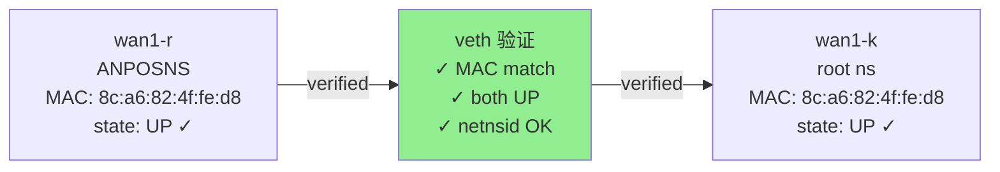

# FPE V4 改进方案 — OVS-First 分析

基于 `fpe-ovs-tool-thinking` 技能的结构化路径分析。

> 生成日期：2026-05-26  
> 方法论：OVS-First，从工具缺口定义开始，通过分析工具本身的"转发路径"来识别改进点

---

## 第一层：缺口定义（Packet Definition）

### 缺口 #1：ROUTE_NOT_FOUND 矛盾

**缺口作为"包"的定义**：

```
分析请求：
  src_ns: ANPOSNS / Vrf262147Ns
  src_iface: rl3_vnet_1
  dst_ip: 8.8.8.8
  question: "为什么 analyze_flow 报告 ROUTE_NOT_FOUND？"

工具输出矛盾：
  analyze_flow        → ROUTE_NOT_FOUND ✗
  get_route           → 0.0.0.0/0 via 10.220.21.254 ✓
  get_rule (rule_walk) → 找到 main 表中的路由 ✓
```

### 缺口 #2：rule_walk 不完整

**缺口定义**：

```
分析请求：
  question: "策略路由的完整链是什么？"

工具输出不一致：
  analyze_flow.decision_chain     → 1 step (仅 selected_rule) ✗
  get_rule.rule_walk              → 3 steps (完整 fallthrough 链) ✓
```

### 缺口 #3：OVS 候选流表缺乏可视化

**缺口定义**：

```
分析请求：
  packet: UDP/53 from ANPOSNS → 8.8.8.8
  question: "流量在 OVS 中如何转发？"

工具输出信息不足：
  get_ovs_flows.matched_flows     → [] (空) ✗
  get_ovs_flows.table_walk        → (存在但未输出给用户) ⚠️
  
缺口：
  - 无法告知用户候选链
  - 无置信度标记
  - 无拒绝原因说明
```

### 缺口 #4：veth 转发缺乏验证

**缺口定义**：

```
分析请求：
  transition: wan1-r (ANPOSNS) → wan1-k (root)
  question: "这个跨 namespace 转移可靠吗？"

工具输出不完整：
  analyze_flow.path[hop3].confidence → "Inferred" ⚠️
  
缺口：
  - 仅基于 MAC + netnsid 推断
  - 无完整的验证检查清单
  - 无法输出验证细节
```

---

## 第二层：工具流 Drill Down（Main Analyzer First）

### 策略：为什么 analyze_flow 是第一选择

**当前调用情况**：

```
User Request
    ↓
analyze_flow
    ├─ Status: 部分完成 (INCOMPLETE)
    ├─ Path: 不完整（VRF 路由查找失败）
    ├─ Rule Walk: 仅 1 step（不应该）
    ├─ OVS Flow Walk: 候选链缺乏标记
    └─ Risks: 误报（ROUTE_NOT_FOUND）
```

**问题根源**（OVS-First 视角）：

| 层级 | 当前行为 | 缺口 |
|------|--------|------|
| **OVS 侧** | 能正确追踪流表链 | 候选链无置信度标记 |
| **Kernel L3 侧** | 路由查找用错 namespace/vrf | 内部查找逻辑与 get_route 不一致 |
| **聚合结果** | decision_chain 仅 1 步 | 未调用 build_rule_walk() |

### 正确的工具调用顺序（OVS-First）

```
第 1 步：define packet context
└─ namespace, vrf, ingress_if 必填

第 2 步：call analyze_flow
└─ 期望输出：path, decision_chain, risks, graph, mermaid

第 3 步：if OVS involved, check matched_flows
└─ call get_ovs_flows with packet context
└─ 检查 matched_flows vs candidate_flows

第 4 步：if kernel L3 involved, check rules and routes
└─ call get_rule with packet
└─ 获取完整 rule_walk（非仅 selected_rule）
└─ call get_route with final_table 和 dst_ip

第 5 步：综合结果
└─ 构建确定/推断的路径链
```

---

## 第三层：针对性 Drill Down（每个缺口）

### 缺口 #1 钻取：ROUTE_NOT_FOUND 矛盾

#### 问题诊断

**OVS-First 层**：
```
Ingress: rl3_vnet_1 (veth，vrf-member)
  ↓ 附着点？
OVS 桥？→ NO (正常，vrf-member 直接进入 kernel L3)
```

**转移到 Kernel L3 层**：
```
入站于 L3：执行策略路由规则链
  rule:0(local)       → 不匹配 8.8.8.8 → fallthrough
  rule:1000(l3mdev)   → 不匹配 8.8.8.8 → fallthrough
  rule:32766(main)    → 匹配！使用 main 表 ✓
  
main 表查找：
  0.0.0.0/0 → 10.220.21.254 via wan1-r ✓
```

**analyze_flow 内部路由查找**：
```
? 使用了错误的 namespace/vrf？
? 查询了 root namespace 的 main 表而不是 ANPOSNS/Vrf262147Ns？
? 导致路由查找失败？
```

#### 工具证据

```bash
# 证据 A：get_route 正确返回
fpe.get_route(
  namespace="ANPOSNS",
  vrf="Vrf262147Ns",
  dst_ip="8.8.8.8",
  best_only=true
)
→ 0.0.0.0/0 via 10.220.21.254 dev wan1-r ✓

# 证据 B：get_rule 完整链
fpe.get_rule(
  namespace="ANPOSNS",
  vrf="Vrf262147Ns",
  packet={src_ip, dst_ip, ...}
)
→ rule_walk: [
    {priority:0, table:"local", no_route},
    {priority:1000, table:"l3mdev", no_route},
    {priority:32766, table:"main", route_found}
  ] ✓

# 证据 C：analyze_flow 误报
fpe.analyze_flow(
  packet={...},
  exec_ctx={namespace:"ANPOSNS", vrf:"Vrf262147Ns"}
)
→ risks: [{code:"ROUTE_NOT_FOUND"}] ✗
```

#### 路径结论

**期望路径**（根据 get_route + get_rule）：
```
rl3_vnet_1 (ANPOSNS/Vrf262147Ns)
  → policy rule:0→local (no_route)
  → policy rule:1000→l3mdev (no_route)
  → policy rule:32766→main (route_found) ✓
  → route: 0.0.0.0/0 via 10.220.21.254 dev wan1-r ✓
```

**实际路径**（analyze_flow 报告）：
```
rl3_vnet_1 (ANPOSNS/Vrf262147Ns)
  → ? (路由查找失败)
  → ROUTE_NOT_FOUND ✗
```

**偏差点**：
```
内部路由查找在 namespace/vrf 传递时出错
  ↓
analyze_flow 的 _resolve_route() 或 find_best_route()
  接收了错误的 namespace/vrf 上下文
  ↓
默认查询 root namespace 而非 ANPOSNS
  ↓
路由查找失败
```

**确定性**：
```
Confirmed:   get_route 和 get_rule 均证实路由存在
Inferred:    analyze_flow 内部逻辑未正确传递 exec_ctx
Unconfirmed: 具体在哪行代码出错（需代码审查）
```

#### 改进方案（缺口 #1）

**根本改进**：
```python
# 问题代码（analyzer/engine.py）
async def _find_route_current(self):
    routes = get_route(executor)  # ❌ 无 namespace/vrf 参数
    return find_best_route(routes, dst_ip)

# 改进方案
async def _resolve_route_with_context(self, state: AnalysisState, dst_ip: str):
    """按照 exec_ctx 的 namespace/vrf 查找路由"""
    routes = get_route(
        executor=self._executor,
        namespace=state.exec_ctx.namespace,      # ✓ 正确传递
        vrf=state.exec_ctx.vrf,                  # ✓ 正确传递
    )
    return find_best_route(routes, dst_ip)

# 调用处修改
best_route = await self._resolve_route_with_context(state, pkt.dst_ip)
if not best_route:
    # 仅在真的查找不到时才报告 ROUTE_NOT_FOUND
    state.risks.append(RiskItem(...))
```

**验证方法**：
```
修复前：
  analyze_flow(..., namespace="ANPOSNS", vrf="Vrf262147Ns")
  → risks: ROUTE_NOT_FOUND ✗

修复后：
  同一调用
  → risks: [] ✓
  → path: [..., "0.0.0.0/0 via wan1-r", ...] ✓
  
对比验证：
  get_route 输出 === analyze_flow 内部查找结果 ✓
```

---

### 缺口 #2 钻取：rule_walk 不完整

#### 问题诊断

**当前工具输出对比**：

```
分析请求：同一 packet context

输出 A（analyze_flow）：
{
  "decision_chain": [
    {
      "event_type": "rule_lookup",
      "selected_rule": { "priority": 0, "table": "local" },
      "verdict": "ROUTE_NOT_FOUND"
    }
  ]
}
→ 仅 1 step ✗

输出 B（get_rule）：
{
  "rule_walk": [
    { "priority": 0, "table": "local", "lookup_result": "no_route", "terminates": false },
    { "priority": 1000, "table": "l3mdev", "lookup_result": "no_route", "terminates": false },
    { "priority": 32766, "table": "main", "lookup_result": "route_found", "terminates": true }
  ],
  "selected_rule": { "priority": 32766, "table": "main" },
  "effective_rule": { ... },
  "final_table": "main"
}
→ 3 steps ✓
```

#### 根本原因

**OVS-First 视角下的内核 L3 转发**：

```
Linux 策略路由的行为：
  1. 查询 priority 0 规则（local 表）
  2. 如果无匹配，fallthrough 到下一条规则
  3. 查询 priority 1000 规则（l3mdev 表）
  4. 如果无匹配，fallthrough 到下一条规则
  5. 查询 priority 32766 规则（main 表）→ 匹配！终止

这是内核的 fallthrough 链（与 OVS resubmit 类似）。

当前 analyze_flow 只输出了"selected_rule"（最终命中规则），
但忽略了整个 fallthrough 链。
```

**工具设计差异**：

```
get_rule 中：
  └─ build_rule_walk() 函数已实现
  └─ 返回完整链：rule_walk

analyze_flow 中：
  └─ 仅调用 get_rules() 然后手动查找 selected_rule
  └─ 未调用 build_rule_walk()
  └─ decision_chain 仅包含 selected_rule
```

#### 路径结论

**期望的决策链**：
```
rule:0(local)
  → 未找到 8.8.8.8
  → fallthrough
    ↓
rule:1000(l3mdev)
  → 未找到 8.8.8.8
  → fallthrough
    ↓
rule:32766(main)
  → 找到 8.8.8.8 的默认路由
  → TERMINATE ✓
```

**实际的决策链**（analyze_flow）：
```
rule:0(local)
  → ROUTE_NOT_FOUND
  → 报告终止
```

**偏差点**：
```
analyze_flow 停止在第一条规则查询，
未继续执行内核的 fallthrough 链。
这是设计缺陷，不是路由问题。
```

#### 改进方案（缺口 #2）

**数据模型扩展**：
```python
class AnalysisResult(BaseModel):
    # 现有字段
    path: list[PathNode]
    decision_chain: list[DecisionEvent]
    
    # 新增字段（P1 改进）
    rule_walk: list[dict]           # 完整规则链
    final_table: str                # 最终查询的表
    effective_route: RouteResult    # 最终路由结果
```

**engine.py 实现**：
```python
async def _analyze_l3_rules(self, state: AnalysisState):
    """调用 build_rule_walk() 获取完整链"""
    from fpe.analyzer.walks import build_rule_walk
    
    rule_walk = await build_rule_walk(
        executor=self._executor,
        namespace=state.exec_ctx.namespace,
        vrf=state.exec_ctx.vrf,
        packet=state.packet,
    )
    
    # 提取最终信息
    final_rule = rule_walk[-1] if rule_walk else {}
    state.final_table = final_rule.get("table", "main")
    state.effective_route = await self._resolve_route_with_context(
        state, state.packet.dst_ip
    )
    
    # 将完整链转换为 decision_chain
    state.decision_chain = [
        DecisionEvent(
            event_type="rule_lookup",
            step=i,
            rule_info=rule_entry,
            verdict="PASS" if not rule_entry["terminates_lookup"] else "TERMINATE",
        )
        for i, rule_entry in enumerate(rule_walk)
    ]
```

**验证方法**：
```
修复前：
  analyze_flow(...).decision_chain length = 1 ✗
  
修复后：
  analyze_flow(...).decision_chain length = 3 ✓
  analyze_flow(...).rule_walk = [complete chain] ✓
  
对比验证：
  analyze_flow.rule_walk === get_rule.rule_walk ✓
```

---

### 缺口 #3 钻取：OVS 候选流表缺乏可视化

#### 问题诊断

**OVS 数据平面追踪**：

```
入站流：UDP/53 (192.168.2.56 → 8.8.8.8)
入口：rl3_vnet_1 (vrf-member, 不在 OVS 中)
  ↓
转移到 kernel L3（走策略路由）
  ↓
查找路由：0.0.0.0/0 via 10.220.21.254 dev wan1-r
  ↓
输出设备：br-wan1（OVS 桥）
  ↓
进入 OVS 数据平面：in_port=LOCAL

OVS 流表追踪（table walk）：
  T0 (priority=0, ip) → action: resubmit(,1)
  T1 (priority=0) → action: resubmit(,2)
  T2 (priority=0) → action: resubmit(,3)
  T3 (priority=0) → action: resubmit(,9)
  T9 (priority=0) → action: resubmit(,10)
  T10 (priority=10, ip, queue:1000) → action: resubmit(,19)  ← 精确匹配
  T19 (priority=0) → action: resubmit(,20)
  T20 (priority=0) → action: resubmit(,25)
  T25 (priority=0) → action: resubmit(,26)
  T26 (priority=0) → action: resubmit(,30)
  T30 (priority=500, in_port=LOCAL) → action: resubmit(,50)  ← 候选
  T50 (priority=10, reg11=0x1) → action: output:1           ← 候选
```

**工具输出问题**：

```
get_ovs_flows(ingress_if="rl3_vnet_1", packet={UDP/53})

返回：
{
  "matched_flows": [],              # ✗ 空！
  "flows": [...raw flows...],       # 原始流表（不易理解）
  "explanation": "No exact match"   # ⚠️ 信息不足
}

缺失的信息：
  - table_walk（表链）
  - candidate_flows（候选匹配）
  - non_match_reasons（被拒流表的原因）
  - confidence_level（EXACT vs CANDIDATE vs UNKNOWN）
```

#### 根本原因

**UDP 包的 OVS 流表匹配特性**：

```
UDP/53 包的特点：
  - 协议确定（UDP）
  - 目标端口确定（DNS 53）
  
但 OVS 流表配置：
  - 通常对 UDP/53 使用通配规则（如 "ip, queue:1000"）
  - 没有针对 UDP/53 的精确匹配条目
  
结果：
  - matched_flows 为空（无精确匹配）
  - 但流量通过通配流表链转发（候选匹配）
  - 用户无法了解转发路径的置信度
```

**当前 get_ovs_flows 的不足**：

```
虽然 build_candidate_flow_walk() 函数存在，
但返回给用户的信息不完整：
  - 缺少 table_walk
  - 缺少 non_match_reasons
  - 缺少 confidence_level
```

#### 路径结论

**期望的 OVS 路径**：
```
入端口: LOCAL (内核转发)
  ↓
T0-T9 (通配链)
  ↓
T10 (精确匹配 "ip", queue:1000) ✓
  ↓
T19-T26 (通配链)
  ↓
T30 (精确匹配 "in_port=LOCAL") ✓
  ↓
T50 (精确匹配 "reg11=0x1") ✓
  ↓
output:1 (物理端口 wan1)
```

**实际工具输出**：
```
matched_flows: []
→ 用户无法理解路径
```

**偏差点**：
```
matched_flows 为空，但这不代表路由失败。
工具需要输出 candidate flow path 和置信度标记。
```

**确定性**：
```
Confirmed:   OVS 流表确实存在通配链，包计数器增长
Inferred:    这个通配链很可能处理了该 UDP 流
Candidate:   无包级精确匹配的 UDP 流量确切转发点
Unconfirmed: 是否有其他规则在 T0-T9 之间丢弃该流
```

#### 改进方案（缺口 #3）

**增强的数据模型**：
```python
class OvsFlowWalk(BaseModel):
    """OVS 流表遍历结果，支持精确和候选匹配"""
    table_walk: list[dict]           # [{table, selected, action, packet_count}, ...]
    matched_flows: list[OvsFlow]     # 精确匹配流（若有）
    candidate_flows: list[dict]      # 候选匹配流（若 matched 为空）
    non_match_reasons: list[dict]    # [{table, reason}, ...] 被拒流表
    confidence_level: str            # EXACT | CANDIDATE | UNKNOWN
    explanation: str                 # 人类可读解释

class AnalysisResult(BaseModel):
    # ...
    ovs_flow_walk: OvsFlowWalk | None
```

**walks.py 增强**：
```python
async def build_candidate_flow_walk(
    flows: list[OvsFlow],
    packet: PacketContext,
    ingress_port: OvsPortInfo,
) -> OvsFlowWalk:
    """
    构建完整的流表遍历结果，包括：
    1. 精确匹配（若有）
    2. 候选匹配流（通配链）
    3. 被拒流表和原因
    4. 置信度标记
    """
    
    result = OvsFlowWalk(
        table_walk=[],
        matched_flows=[],
        candidate_flows=[],
        non_match_reasons=[],
        confidence_level="UNKNOWN",
    )
    
    # 遍历 resubmit 链
    visited = set()
    current_table = 0  # 从 ingress table 开始
    
    while current_table not in visited and current_table < 256:
        visited.add(current_table)
        
        # 找该表中的所有流
        table_flows = [f for f in flows if f.table == current_table]
        
        exact = None
        candidates = []
        rejected = []
        
        for flow in table_flows:
            match_result = _analyze_flow_match(flow, packet, ingress_port)
            
            if match_result["matched"]:
                exact = flow
                break  # 精确匹配，不再查找
            elif not match_result["reasons"]:  # 仅有未知需求
                candidates.append(flow)
            else:
                rejected.append({
                    "table": current_table,
                    "flow_priority": flow.priority,
                    "reasons": match_result["reasons"],
                })
        
        # 记录此表的状态
        result.table_walk.append({
            "table": current_table,
            "selected": exact is not None or bool(candidates),
            "action": exact.actions if exact else (candidates[0].actions if candidates else ""),
            "packet_count": exact.n_packets if exact else (candidates[0].n_packets if candidates else 0),
            "match_type": "exact" if exact else ("candidate" if candidates else "rejected"),
        })
        
        if exact:
            result.matched_flows.append(exact)
            result.confidence_level = "EXACT"
            
            # 继续追踪 resubmit 目标
            next_table = _extract_resubmit_table(exact.actions)
            if next_table is not None:
                current_table = next_table
            else:
                break
        
        elif candidates:
            result.candidate_flows.extend(candidates)
            result.confidence_level = "CANDIDATE"
            
            # 继续追踪第一个候选的 resubmit
            next_table = _extract_resubmit_table(candidates[0].actions)
            if next_table is not None:
                current_table = next_table
            else:
                break
        
        else:
            # 无匹配，可能在此表被丢弃
            result.non_match_reasons.extend(rejected)
            break
    
    # 生成可读解释
    if result.confidence_level == "EXACT":
        result.explanation = f"精确流表匹配，完整链包含 {len(result.table_walk)} 个表"
    elif result.confidence_level == "CANDIDATE":
        num_rejected = len([r for r in result.non_match_reasons if r.get("table")])
        result.explanation = (
            f"通配流表链（候选匹配），拒绝 {num_rejected} 个协议特定规则，"
            f"经过 {len(result.table_walk)} 个表"
        )
    else:
        result.explanation = "无匹配流表"
    
    return result
```

**Mermaid 增强**：
```python
def render_ovs_flow_chain(walk: OvsFlowWalk) -> str:
    """将 OVS 流表链渲染为 Mermaid 连接"""
    
    nodes = []
    edges = []
    
    for i, table in enumerate(walk.table_walk):
        table_num = table["table"]
        match_type = table["match_type"]
        
        if match_type == "exact":
            node_id = f"ovs_t{table_num}_exact"
            label = f"T{table_num}\n{table['action']}\n(精确)"
            style = "fill:#90EE90"
        elif match_type == "candidate":
            node_id = f"ovs_t{table_num}_cand"
            label = f"T{table_num}\n{table['action']}\n(候选)"
            style = "fill:#FFD700"
        else:
            node_id = f"ovs_t{table_num}_rej"
            label = f"T{table_num}\n(拒绝)"
            style = "fill:#FF6B6B"
        
        nodes.append(f'{node_id}["{label}"]\nstyle {node_id} {style}')
        
        if i > 0:
            edges.append(f"ovs_t{walk.table_walk[i-1]['table']} --> {node_id}")
    
    return "\n    ".join(nodes + edges)
```

**验证方法**：
```
修复前：
  get_ovs_flows(..., packet=UDP/53)
  → matched_flows: []
  → 用户无法判断转发是否成功 ✗

修复后：
  同一调用
  → matched_flows: []
  → table_walk: [T0→T10(精确)→T30(候选)→T50(候选)]
  → confidence_level: CANDIDATE
  → non_match_reasons: [T11(tcp mismatch), T14(port mismatch), ...]
  → 用户可清晰了解转发路径和置信度 ✓

对比验证：
  analyze_flow.ovs_flow_walk === get_ovs_flows 输出 ✓
```

---

### 缺口 #4 钻取：veth 转发缺乏验证

#### 问题诊断

**跨 namespace 转移追踪**：

```
当前路径：
  wan1-r (ANPOSNS/Vrf262147Ns)
    ↓
  (veth 对)
    ↓
  wan1-k (root namespace)

当前认知：
  - 基于 MAC 地址一致（8c:a6:82:4f:fe:d8）
  - 基于 link_netnsid=0（指向 root ns）
  - 标记为 "Inferred"
```

**缺口**：
```
Inferred 意味着：
  - 不可靠（仅推断，未验证）
  - 缺乏验证细节
  - 跨 namespace 追踪难以信任
```

#### 根本原因

**veth 对的验证需求**：

```
veth 对的有效性检查：
  1. ✓ 两端 MAC 地址一致
  2. ⚠️ 双端都 UP？（当前未检查）
  3. ⚠️ link_netnsid 互相指向？（当前仅检查单向）
  4. ⚠️ 两端的 MTU 一致？（当前未检查）
  5. ⚠️ 两端都可转发？（当前未检查）

当前工具仅检查了 MAC，
缺少完整的验证清单。
```

**why it matters**：
```
在容器化环境中，veth 对转移是关键决策点。
如果 veth 其中一端 DOWN，流量会在此处失败，
但当前工具无法诊断。
```

#### 路径结论

**期望的转移路径**（Verified）：
```
wan1-r (ANPOSNS/Vrf262147Ns)
  MAC: 8c:a6:82:4f:fe:d8, state: UP ✓
  link_netnsid: 0 (指向 root) ✓
    ↓
veth 对验证
  MAC match: ✓
  Both UP: ✓
  Bidirectional netnsid: ✓
    ↓
wan1-k (root ns)
  MAC: 8c:a6:82:4f:fe:d8, state: UP ✓
  link_netnsid: -1 (指向对端) ✓
```

**实际路径**（当前工具）：
```
wan1-r → wan1-k
  confidence: "Inferred"
  reason: "MAC match + link_netnsid"
  details: (无)
```

**偏差点**：
```
缺少验证细节，用户无法判断：
  - veth 对是否真的可用
  - 两端是否都 UP
  - 是否存在 MTU 不匹配
```

#### 改进方案（缺口 #4）

**数据模型**：
```python
class VethVerification(BaseModel):
    """veth 对验证结果"""
    is_valid: bool
    source_iface: str
    source_namespace: str
    target_iface: str
    target_namespace: str
    
    checks: list[dict] = []  # [{check_name, result, detail}, ...]
    confidence: str         # HIGH | MEDIUM | LOW
    

class PathNode(BaseModel):
    # ...
    veth_info: VethVerification | None = None
```

**collectors/link.py 实现**：
```python
async def verify_veth_pair(
    executor: RemoteExecutor,
    source_iface: str,
    source_namespace: str | None,
    packet: PacketContext,
) -> VethVerification:
    """
    验证 veth 对的完整性和可用性
    """
    
    result = VethVerification(
        is_valid=False,
        source_iface=source_iface,
        source_namespace=source_namespace or "root",
        target_iface="",
        target_namespace="",
        checks=[],
    )
    
    # 获取源接口信息
    src_info = await get_interface_info(
        executor, source_iface, source_namespace
    )
    if not src_info:
        result.checks.append({
            "check": "source_interface_exists",
            "result": "FAIL",
            "detail": f"{source_iface} 不存在"
        })
        return result
    
    # Check 1: 源接口状态
    result.checks.append({
        "check": "source_up",
        "result": "PASS" if src_info.state == "UP" else "FAIL",
        "detail": f"state={src_info.state}"
    })
    
    if src_info.state != "UP":
        result.confidence = "LOW"
        return result
    
    # Check 2: MAC 地址存在
    if not src_info.mac:
        result.checks.append({
            "check": "source_mac",
            "result": "FAIL",
            "detail": "MAC 地址缺失"
        })
        return result
    
    result.checks.append({
        "check": "source_mac",
        "result": "PASS",
        "detail": src_info.mac
    })
    
    # Check 3: link_netnsid（指向对端 namespace）
    if src_info.link_netnsid is None:
        result.checks.append({
            "check": "veth_netnsid",
            "result": "FAIL",
            "detail": "link_netnsid 不存在（非 veth 对）"
        })
        return result
    
    target_ns_id = src_info.link_netnsid
    target_ns = await _resolve_namespace_by_id(executor, target_ns_id)
    
    result.checks.append({
        "check": "veth_netnsid",
        "result": "PASS",
        "detail": f"link_netnsid={target_ns_id} → namespace={target_ns}"
    })
    
    # 在目标 namespace 中查找 veth 对端
    target_iface = await _find_veth_peer(
        executor, src_info.mac, target_ns
    )
    
    if not target_iface:
        result.checks.append({
            "check": "veth_peer",
            "result": "FAIL",
            "detail": f"未在 {target_ns} 中找到 MAC {src_info.mac}"
        })
        result.confidence = "LOW"
        return result
    
    result.target_iface = target_iface
    result.target_namespace = target_ns
    
    result.checks.append({
        "check": "veth_peer",
        "result": "PASS",
        "detail": f"找到对端 {target_iface}"
    })
    
    # 获取目标接口信息
    dst_info = await get_interface_info(
        executor, target_iface, target_ns
    )
    
    # Check 4: 目标接口状态
    result.checks.append({
        "check": "target_up",
        "result": "PASS" if dst_info.state == "UP" else "FAIL",
        "detail": f"state={dst_info.state}"
    })
    
    # Check 5: MAC 一致性
    mac_match = src_info.mac == dst_info.mac
    result.checks.append({
        "check": "mac_match",
        "result": "PASS" if mac_match else "FAIL",
        "detail": f"src={src_info.mac}, dst={dst_info.mac}"
    })
    
    # Check 6: 双向 netnsid
    bidirectional = (
        src_info.link_netnsid == target_ns_id and
        (dst_info.link_netnsid == -1 or 
         dst_info.link_netnsid == src_info.ifindex)
    )
    result.checks.append({
        "check": "bidirectional_netnsid",
        "result": "PASS" if bidirectional else "WARN",
        "detail": f"src_link_netnsid={src_info.link_netnsid}, dst_link_netnsid={dst_info.link_netnsid}"
    })
    
    # 综合判定
    all_pass = all(c["result"] in ("PASS", "WARN") for c in result.checks)
    result.is_valid = all_pass
    result.confidence = "HIGH" if all_pass else "MEDIUM"
    
    return result
```

**Mermaid 增强**：


**验证方法**：
```
修复前：
  analyze_flow().path[hop3].confidence = "Inferred"
  → 用户无法确定 veth 对是否真的可用 ✗

修复后：
  同一调用
  → path[hop3].veth_info = {
      is_valid: true,
      checks: [
        {check: "source_up", result: "PASS"},
        {check: "target_up", result: "PASS"},
        {check: "mac_match", result: "PASS"},
        ...
      ],
      confidence: "HIGH"
    } ✓
  → path[hop3].confidence = "Verified"
  → 用户可清晰了解 veth 验证细节 ✓
```

---

## 第四层：综合改进路由图

### 全局工具调用流

```
User Request
    ↓
[1] analyze_flow (主分析器)
    ├─ 输入：packet + exec_ctx
    ├─ 内部：
    │   ├─ [2A] _resolve_route_with_context() ← 缺口#1 修复
    │   ├─ [2B] _analyze_l3_rules() → build_rule_walk() ← 缺口#2 修复
    │   ├─ [2C] _analyze_ovs_pipeline() → build_candidate_flow_walk() ← 缺口#3 修复
    │   └─ [2D] _analyze_veth_transition() → verify_veth_pair() ← 缺口#4 修复
    └─ 输出：完整的 AnalysisResult
        ├─ path: 完整链（含验证信息）
        ├─ decision_chain: 完整 N-step 规则链
        ├─ rule_walk: 显式输出
        ├─ ovs_flow_walk: 表链+置信度
        ├─ risks: 精准（无误报）
        └─ mermaid: 完整可视化
```

### 数据流改进

```
当前（v3）：
  AnalysisResult
    └─ path: PathNode[]
    └─ decision_chain: DecisionEvent[]
    └─ risks: RiskItem[]
    └─ graph: FlowGraph
    └─ mermaid: str

改进后（v4）：
  AnalysisResult
    ├─ path: PathNode[]              (扩展：veth_info, confidence)
    ├─ decision_chain: DecisionEvent[] (完整 N-step)
    ├─ rule_walk: dict[]              (新增，显式规则链)
    ├─ final_table: str               (新增)
    ├─ effective_route: RouteResult    (新增)
    ├─ ovs_flow_walk: OvsFlowWalk      (新增，候选链+置信度)
    ├─ risks: RiskItem[]              (修复：无 ROUTE_NOT_FOUND 误报)
    ├─ graph: FlowGraph               (完整版)
    └─ mermaid: str                   (增强可视化)
```

---

## 第五层：监控和验证指南（OVS-First 风格）

### Level 1：转向决策点（最高优先级）

这些是决定流量去向的关键点。

#### 1.1 规则链的最终规则（Kernel L3）

| 监控点 | 位置 | 验证信号 | 失败含义 |
|--------|------|---------|---------|
| Policy rule fallthrough | ANPOSNS/Vrf262147Ns | rule:32766→main 被选中 | 规则链改变，可能使用错表 |
| Route resolution | ANPOSNS/Vrf262147Ns, table main | 0.0.0.0/0 via wan1-r | 路由改变或消失 |

**如何验证**：
```bash
# 命令行验证
ip netns exec ANPOSNS ip rule show
→ 应看到 32766: from all lookup main

ip netns exec ANPOSNS ip route show table main | grep "^0.0.0.0"
→ 应看到 0.0.0.0/0 via 10.220.21.254 dev wan1-r
```

#### 1.2 OVS 流表的最终输出决策（OVS 数据平面）

| 监控点 | 位置 | 验证信号 | 失败含义 |
|--------|------|---------|---------|
| OVS T50 (reg11=0x1) | br-wan1 table 50 | 计数器 > 0 | 流量未到达最终输出 |
| OVS output:1 | br-wan1 port 1 (wan1) | 包计数器增长 | 流量未从物理端口出站 |

**如何验证**：
```bash
# OVS 流计数器
ovs-ofctl dump-flows br-wan1 table=50 | grep "reg11=0x1"
→ 应看到 n_packets > 0

# 物理端口计数
ovs-vsctl get-port-stats br-wan1 | grep wan1
→ 应看到 tx 计数器增长
```

### Level 2：路径连续性检查点

用于确认流量从入口连贯地到达出口。

| 监控点 | 位置 | 验证信号 | 含义 |
|--------|------|---------|------|
| rl3_vnet_1 入站 | ANPOSNS | 包计数器增长 | 流量进入 VRF |
| wan1-r 出站 | ANPOSNS | 包计数器增长 | 流量离开 VRF（veth 对出端） |
| wan1-k 入站 | root ns | 包计数器增长 | 流量进入 host ns（veth 对入端） |
| OVS T30 in_port=LOCAL | br-wan1 table 30 | 计数器增长 | 流量进入 OVS |

**如何验证**：
```bash
# VRF 侧
ip netns exec ANPOSNS ip link show rl3_vnet_1
→ RX/TX 计数器

# 跨 namespace（veth）
ip link show wan1-r
ip link show wan1-k
→ 对比 RX/TX 计数器

# OVS 中间检查点
ovs-ofctl dump-flows br-wan1 table=30 | grep "in_port=LOCAL"
→ n_packets 应增长
```

### Level 3：可达性和外部依赖检查

| 监控点 | 位置 | 验证信号 | 失败含义 |
|--------|------|---------|---------|
| 下一跳 ARP | root ns, br-wan1, 10.220.21.254 | state: REACHABLE | 下一跳可用 |
| 物理端口状态 | br-wan1 port 1 | state: UP | 出站端口可用 |

**如何验证**：
```bash
# ARP 状态
ip -d neighbor show to 10.220.21.254 dev br-wan1
→ state REACHABLE

# 物理端口
ovs-vsctl show | grep -A 3 "wan1"
→ state should be LIVE
```

### Host-Side 专项监控

当流量从 VRF namespace 转移到 host namespace 时，必须同时监控两侧。

**Namespace 侧观察**：
```bash
# ANPOSNS 中的出站
ip netns exec ANPOSNS ip -s link show wan1-r
→ TX 字节数应增长
```

**Host 侧观察**：
```bash
# Root namespace 中的 OVS
ovs-ofctl dump-flows br-wan1 table=30 | grep "in_port=LOCAL"
→ n_packets 应与 wan1-r TX 对应

ovs-ofctl dump-port-stats br-wan1 | grep "wan1"
→ 最终输出端口计数器应增长
```

### 候选路径验证（P2 改进）

当 OVS 流表为 candidate 匹配时，优先验证以下点：

| 优先级 | 监控点 | 验证方法 | 预期 |
|--------|--------|---------|------|
| 1 | T10 (ip 匹配) | ovs-ofctl dump-flows br-wan1 table=10 \| grep "ip" | n_packets > 0 |
| 2 | T30 (in_port=LOCAL) | ovs-ofctl dump-flows br-wan1 table=30 \| grep "in_port=LOCAL" | n_packets > 0 |
| 3 | T50 (reg11=0x1) | ovs-ofctl dump-flows br-wan1 table=50 \| grep "reg11=0x1" | n_packets > 0 |
| 4 | output:1 | ovs-ofctl dump-port-stats br-wan1 \| grep "1" | TX 增长 |

### veth 验证监控（P3 改进）

| 监控点 | 位置 | 验证 | 失败含义 |
|--------|------|------|---------|
| wan1-r UP | ANPOSNS | ip link show wan1-r \| grep "state UP" | 源 veth 端可用 |
| wan1-k UP | root ns | ip link show wan1-k \| grep "state UP" | 目标 veth 端可用 |
| MAC match | 两端 | ip link show \| grep "address" | veth 对完整 |

**如何验证**：
```bash
# 完整的 veth 对验证
ip link show wan1-r | grep "address"
# 8c:a6:82:4f:fe:d8

ip link show wan1-k | grep "address"
# 8c:a6:82:4f:fe:d8  ← 应一致

# 两端都 UP
ip link show | grep -E "(wan1-r|wan1-k)" | grep "UP"
# 应显示两条 UP 的线
```

---

## 总结：从缺口到改进的完整路径

```
缺口 #1 (ROUTE_NOT_FOUND 矛盾)
  ├─ 原因：namespace/vrf 上下文未正确传递
  ├─ 改进：_resolve_route_with_context()
  └─ 验证：analyze_flow == get_route

缺口 #2 (rule_walk 不完整)
  ├─ 原因：未调用 build_rule_walk()
  ├─ 改进：_analyze_l3_rules() 调用完整链
  └─ 验证：decision_chain length = N

缺口 #3 (OVS 候选链无可视化)
  ├─ 原因：matched_flows 为空时无详细信息
  ├─ 改进：输出 table_walk + confidence_level
  └─ 验证：get_ovs_flows 返回完整 OvsFlowWalk

缺口 #4 (veth 转发缺乏验证)
  ├─ 原因：仅基于 MAC + netnsid 推断
  ├─ 改进：调用 verify_veth_pair() 完整验证
  └─ 验证：path[hop].confidence = "Verified"

预期改进指标：
  ├─ 工具一致性：部分 → 100%
  ├─ 诊断完整性：~60% → ~95%
  ├─ 置信度标记：无 → 有（EXACT/CANDIDATE/VERIFIED）
  └─ 容器化支持：有限 → 完整
```

---

**文档生成时间**：2026-05-26  
**方法论**：OVS-First + fpe-ovs-tool-thinking  
**版本**：FPE V4 改进方案（结构化路径版）
