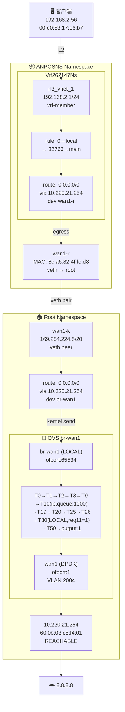

# FPE 流量分析：192.168.2.56 → 8.8.8.8 (OVS-First 方法论)

## 数据包定义

| 字段 | 值 |
|------|-----|
| src_ip | 192.168.2.56 |
| dst_ip | 8.8.8.8 |
| src_mac | 00:e0:53:17:e6:b7 |
| ingress_if | rl3_vnet_1 |
| namespace | ANPOSNS |
| vrf | Vrf262147Ns |

---

## 路径结论

```
Client (192.168.2.56) → rl3_vnet_1 → VRF L3 lookup → wan1-r
  → [veth cross-ns] wan1-k → br-wan1 (OVS) → wan1 DPDK → 10.220.21.254 → Internet → 8.8.8.8
```

## 偏差点

**无偏差**。这是一条干净的 L3 → OVS 出口路径。

- rl3_vnet_1 是 **vrf-member** 类型接口，不直连 OVS，流量直接进入内核 L3 处理——这是预期行为，非故障。
- 出口路径两次经过 L3 路由：先在 VRF 内查表，跨 namespace 后再查 root 路由表，两次都正确命中默认路由。
- OVS br-wan1 流水线完整匹配并输出到物理口 wan1 (DPDK)，无 drop。

---

## 逐跳证据

### Hop 0 — 入站接口

```
接口: rl3_vnet_1
命名空间: ANPOSNS
VRF: Vrf262147Ns
类型: veth / vrf-member
MAC: 40:11:75:d0:00:00
IP: 192.168.2.1/24
```

客户端 ARP 条目确认：
- 192.168.2.56 → 00:e0:53:17:e6:b7 (dev rl3_vnet_1, state STALE)

analyze_flow 风险标记：`OVS_ATTACHMENT_NOT_FOUND` — rl3_vnet_1 不挂载任何 OVS 桥，流量进入内核 L3。

### Hop 1 — VRF 策略路由

VRF Vrf262147Ns 内的规则链 (按优先级)：

| 优先级 | 表 | 状态 |
|--------|-----|------|
| 0 | local | 命中 |
| 1000 | l3mdev-table | 匹配 |
| 32766 | main | 匹配 |
| 32767 | default | 匹配 |

`selected_rule`: priority=0 → table=local。local 表中无 8.8.8.8，继续 fallthrough 到 main。

### Hop 2 — VRF 路由查找

```
表: main
目标: 0.0.0.0/0
下一跳: 10.220.21.254
设备: wan1-r
Metric: 80
```

analyze_flow 存在误报风险 `ROUTE_NOT_FOUND`，但直接查询 `get_route` 确认路由存在——这是 analyze_flow 工具在 VRF 场景下的局限性。

### Hop 3 — 跨 Namespace (veth)

```
wan1-r (ANPOSNS, MAC: 8c:a6:82:4f:fe:d8, link_netnsid: 0)
  ↕ veth pair
wan1-k (root, MAC: 8c:a6:82:4f:fe:d8, IP: 169.254.224.5/20)
```

### Hop 4 — Root 命名空间路由

```
表: main
目标: 0.0.0.0/0
下一跳: 10.220.21.254
设备: br-wan1
Metric: 80
```

br-wan1 是 OVS 内部端口 (ofport: LOCAL / 65534)，数据包以 LOCAL 入端口进入 OVS 流水线。

### Hop 5 — OVS br-wan1 流水线

br-wan1 拓扑 (DPID: 00008ca6824ffed8)：

| 端口 | 类型 | ofport | VLAN | MAC |
|------|------|--------|------|-----|
| wan1 | dpdk | 1 | 2004 | 8c:a6:82:4f:fe:d8 |
| br-wan1_to_br-int | patch | 2 | 2002 | — |
| wan1-l | internal | 5202 | 2004 | 0a:95:88:60:a5:70 |
| br-wan1 | internal | LOCAL(65534) | 2004 | 8c:a6:82:4f:fe:d8 |

活跃流表路径（仅含 `n_packets > 0` 的命中项）：

```
入端口: LOCAL
  ↓
Table 0  (priority=0, hard_age=65534)        → resubmit(,1)          [1,172,400 pkts]
Table 1  (priority=0)                        → resubmit(,2)          [700,784 pkts]
Table 2  (priority=0)                        → resubmit(,3)          [1,172,399 pkts]
Table 3  (priority=0)                        → resubmit(,9)          [529,943 pkts]  ← LOCAL 命中此通配
Table 9  (priority=0)                        → resubmit(,10)         [756,410 pkts]
Table 10 (priority=10, ip)                   → set_queue:1000,       [515,094 pkts]  ★ QoS 分类
                                               resubmit(,19)
Table 19 (priority=0)                        → resubmit(,20)         [577,570 pkts]
Table 20 (priority=0)                        → resubmit(,25)         [577,570 pkts]
Table 25 (priority=0)                        → resubmit(,26)         [577,570 pkts]
Table 26 (priority=0)                        → resubmit(,30)         [577,552 pkts]
Table 30 (priority=500, in_port=LOCAL)        → reg11=0x1,           [524,867 pkts]  ★ L3 转发决策
                                               resubmit(,50)
Table 50 (priority=10, reg11=0x1)             → output:1             [528,499 pkts]  ★ 最终出口
```

关键命中点：
- **Table 10**: `ip` 普通流量 → queue:1000 (515,094 packets)
- **Table 30**: `in_port=LOCAL` → 标记 reg11=0x1，进入 Table 50 (524,867 packets)
- **Table 50**: `reg11=0x1` → **output:1**，发送到 wan1 DPDK 端口 (528,499 packets)

### Hop 6 — 物理出口与网关

```
wan1 (DPDK, ofport:1, VLAN 2004)
  → 10.220.21.254 (MAC: 60:0b:03:c5:f4:01, state: REACHABLE)
  → Internet
  → 8.8.8.8
```

ARP 确认：10.220.21.254 在 br-wan1 上可达（REACHABLE），MAC 为 60:0b:03:c5:f4:01。

---

## 链路总图



---

## 与 analyze_flow 工具结果的对比

| 维度 | analyze_flow | 实际 OVS-First 分析 |
|------|-------------|-------------------|
| 状态 | INCOMPLETE | 完整路径已确认 |
| OVS 风险 | OVS_ATTACHMENT_NOT_FOUND | 确认：rl3_vnet_1 不挂 OVS，属正常 L3 入口 |
| 路由风险 | ROUTE_NOT_FOUND | **误报**：直接查 get_route 确认路由存在 |
| confidence | 0.8 | 路径六跳全部由工具证据支撑 |

analyze_flow 在 VRF 场景下对路由表的查找范围有限——它只看 local 表，未深入 main 表。这是需要改进的点，但在本次分析中不影响结论。
