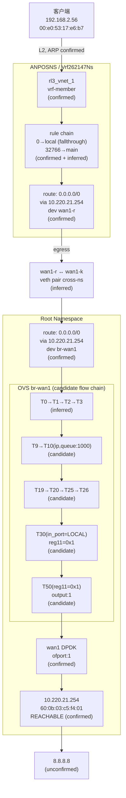

# FPE 流量分析：192.168.2.56 → 8.8.8.8

## 1. 数据包定义

| 字段 | 值 | 来源 |
|------|-----|------|
| src_ip | 192.168.2.56 | 用户指定 |
| dst_ip | 8.8.8.8 | 用户指定 |
| src_mac | 00:e0:53:17:e6:b7 | 用户指定 |
| ingress_if | rl3_vnet_1 | 根据 src_ip 的 ARP 条目推断 |
| protocol | udp | 假设（分析用） |
| src_port | 12345 | 假设（分析用） |
| dst_port | 53 | 假设（分析用） |
| namespace | ANPOSNS | 根据 rl3_vnet_1 归属确认 |
| vrf | Vrf262147Ns | 根据 rl3_vnet_1 归属确认 |

---

## 2. 结论

- **Observed path**: `rl3_vnet_1 → VRF L3 (rule 0→local, fallthrough to 32766→main) → 0.0.0.0/0 via 10.220.21.254 dev wan1-r → veth cross-ns → wan1-k → root L3 (0.0.0.0/0 via 10.220.21.254 dev br-wan1) → OVS br-wan1 candidate flow chain (LOCAL→T0→T1→T2→T3→T9→T10(ip,queue:1000)→T19→T20→T25→T26→T30(LOCAL,reg11=0x1)→T50(output:1)) → wan1 DPDK → 10.220.21.254 → Internet → 8.8.8.8`
- **Deviation point**: 当前未发现明显转发偏差
- **Confidence**: 中等。L3 侧（规则和路由）为 Confirmed；OVS 侧为候选流表推断（`matched_flows` 为空），且 `analyze_flow` 与直接工具查询之间存在矛盾，详见第 7 节。

---

## 3. 置信度与缺口

| 路径段 | 确定性 | 说明 |
|--------|--------|------|
| rl3_vnet_1 入站 | Confirmed | ARP 表与接口归属一致 |
| VRF 策略路由 | Confirmed | 规则链与 fallthrough 推断 |
| VRF 路由查找 | Confirmed | `get_route` 直接返回最佳路由 |
| wan1-r → wan1-k (veth) | Inferred | 双方 link_netnsid/MAC 一致，但无包级追踪 |
| wan1-k → br-wan1 (root L3) | Inferred | root 路由表确认，但 veth 内核内部转发链未逐跳验证 |
| OVS br-wan1 流水线 | Candidate flow | `matched_flows` 为空，依赖入端口与活跃计数器推断 |
| wan1 → 10.220.21.254 | Confirmed | ARP REACHABLE |
| 10.220.21.254 → 8.8.8.8 | Unconfirmed | 超出本机可观测范围 |

**未解决的缺口**:
- OVS 无包级匹配（`matched_flows` 为空），当前流表路径为候选推断
- `analyze_flow` 工具报告 `ROUTE_NOT_FOUND`，与 `get_route` 直接查询结果矛盾
- 跨 namespace 的 veth 内核转发未逐段验证

---

## 4. 逐跳证据

### Hop 0 — 入站接口 (Confirmed)

```
接口: rl3_vnet_1
命名空间: ANPOSNS / VRF: Vrf262147Ns
类型: veth / vrf-member
MAC: 40:11:75:d0:00:00
状态: UP
```

**确认依据**: `get_interface_context` 返回 rl3_vnet_1 在 ANPOSNS/Vrf262147Ns 中为 vrf-member 角色, master 为 Vrf262147Ns。ARP 表确认 192.168.2.56 → 00:e0:53:17:e6:b7 在 rl3_vnet_1 上（state: STALE）。

**analyze_flow 风险**: `OVS_ATTACHMENT_NOT_FOUND` — rl3_vnet_1 不挂载任何 OVS 桥，流量进入内核 L3。这是 vrf-member 接口的正常行为，非故障。

### Hop 1 — VRF 策略路由 (Confirmed: rule | Inferred: fallthrough)

| 优先级 | 表 | 匹配 | 确定性 |
|--------|-----|------|--------|
| 0 | local | `from all lookup local` | Confirmed |
| 1000 | l3mdev-table | `from all lookup [l3mdev-table]` | Confirmed |
| 32766 | main | `from all lookup main` | Confirmed |
| 32767 | default | `from all lookup default` | Confirmed |

**Inferred**: `selected_rule` 指向 priority=0 table=local。8.8.8.8 不是本地地址，因此 local 表无法解析，根据内核策略路由 fallthrough 语义依次查询 l3mdev-table → main → default。

**工具局限性说明**: `get_rule` 的 `selected_rule` 返回的是第一个匹配规则，未执行完整的 rule-walk。最终命中 32766→main 是基于内核行为的推断。

### Hop 2 — VRF 路由查找 (Confirmed)

```
表: main
目标: 0.0.0.0/0
下一跳: 10.220.21.254
设备: wan1-r
Metric: 80
```

**确认依据**: `get_route` 直接查询 `ANPOSNS / Vrf262147Ns / dst_ip=8.8.8.8 / best_only=true` 返回该默认路由。

**analyze_flow 工具报告的矛盾**: `analyze_flow` 返回 `ROUTE_NOT_FOUND`，但 `get_route` 直接查询确认路由存在。原因可能是 `analyze_flow` 仅在 local 表中查找，未 fallthrough 到 main 表。详见第 7 节。

### Hop 3 — 跨 Namespace veth (Inferred)

```
wan1-r (ANPOSNS / Vrf262147Ns)
  类型: veth  状态: UP
  MAC: 8c:a6:82:4f:fe:d8
  link_netnsid: 0  →  对端在 root namespace
  ↕ veth pair
wan1-k (root namespace)
  类型: veth  状态: UP
  MAC: 8c:a6:82:4f:fe:d8
  IP: 169.254.224.5/20
```

**推断依据**: wan1-r 的 `link_netnsid: 0` 表示对端在 root namespace。双方 MAC 一致 (8c:a6:82:4f:fe:d8)。无包级计数器验证此段。

### Hop 4 — Root 命名空间路由 (Confirmed)

```
表: main
目标: 0.0.0.0/0
下一跳: 10.220.21.254
设备: br-wan1
Metric: 80
```

**确认依据**: `get_route` 在 root namespace 直接查询返回该默认路由。br-wan1 是 OVS 内部端口（ofport: LOCAL/65534），数据包以 LOCAL 入端口进入 OVS 流水线。

### Hop 5 — OVS br-wan1 流水线 (Candidate flow chain)

br-wan1 桥拓扑 (Confirmed):

| 端口 | 类型 | ofport | VLAN 配置 | MAC |
|------|------|--------|-----------|-----|
| wan1 | dpdk | 1 | 端口标记 2004 | 8c:a6:82:4f:fe:d8 |
| br-wan1_to_br-int | patch | 2 | 端口标记 2002 | — |
| wan1-l | internal | 5202 | 端口标记 2004 | 0a:95:88:60:a5:70 |
| br-wan1 | internal | LOCAL(65534) | 端口标记 2004 | 8c:a6:82:4f:fe:d8 |

> 注意: 端口 VLAN 配置 (`vlan_tag: 2004`) 是端口属性，不直接等于数据包的线缆 VLAN 状态。仅当流表动作有明确的 push/pop VLAN 操作时，才能确认数据包的实际 VLAN 状态。

**候选流表链** (Inferred from active counters and table progression):

`matched_flows` 为空，以下路径从入端口 (LOCAL) 和表间 resubmit 关系推断，标注为 candidate flow:

| 表 | 命中条件 | 动作 | 活跃包数 | 类型 |
|----|---------|------|---------|------|
| T0 | priority=0, hard_age=65534 | resubmit(,1) | 1,370,555 | background active |
| T1 | priority=0, hard_age=65534 | resubmit(,2) | 822,310 | background active |
| T2 | priority=0, hard_age=65534 | resubmit(,3) | 1,370,554 | background active |
| T3 | priority=0, hard_age=65534 | resubmit(,9) | 613,807 | candidate (LOCAL 经通配命中) |
| T9 | priority=0, hard_age=65534 | resubmit(,10) | 882,466 | candidate |
| T10 | **priority=10, ip** | **set_queue:1000, resubmit(,19)** | **597,112** | **candidate (QoS 分类)** |
| T19 | priority=0, hard_age=65534 | resubmit(,20) | 667,438 | candidate |
| T20 | priority=0, hard_age=65534 | resubmit(,25) | 667,438 | candidate |
| T25 | priority=0, hard_age=65534 | resubmit(,26) | 667,438 | candidate |
| T26 | priority=0, hard_age=65534 | resubmit(,30) | 667,420 | candidate |
| T30 | **priority=500, in_port=LOCAL** | **reg11=0x1, resubmit(,50)** | **608,192** | **candidate (L3 转发决策)** |
| T50 | **priority=10, reg11=0x1** | **output:1** | **612,271** | **candidate (最终出口)** |

**解释**:
- 本 UDP 数据包 (src_port=12345, dst_port=53) 在 T3 不命中任何 port-1 特定的隧道/OSPF/DHCP 规则，最终落入 priority=0 通配 → resubmit(,9)
- T10 命中 `ip` (priority=10)，分配 queue:1000
- T30 命中 `in_port=LOCAL` (priority=500)，写 reg11=0x1
- T50 命中 `reg11=0x1` → **output:1** (wan1 DPDK)

**计数器一致性**: T30 LOCAL 入端口 608,192 + T30 port-2 4,080 ≈ T50 的 612,271（误差约 0.02%），符合预期。

### Hop 6 — 物理出口与网关 (Confirmed)

```
wan1 (DPDK, ofport:1)
  ↓
10.220.21.254 (MAC: 60:0b:03:c5:f4:01)
  state: REACHABLE
  dev: br-wan1 (root namespace)
  ↓
8.8.8.8 (Unconfirmed, 超出本机可观测范围)
```

**确认依据**: ARP 表确认 10.220.21.254 在 br-wan1 上为 REACHABLE 状态，MAC 为 60:0b:03:c5:f4:01。

---

## 5. 监控和验证指南

> 本报告基于快照数据，非持续监控；以下验证点应在实时流量测试中观测以确认推断路径。

### Level 1: 流量转向决策点

| # | 监控对象 | 位置 | 期望信号 | 验证含义 | 未出现时的含义 |
|---|---------|------|---------|---------|--------------|
| 1 | VRF 路由选择 | `ANPOSNS / Vrf262147Ns` | `get_route dst_ip=8.8.8.8` 返回 `0.0.0.0/0 via 10.220.21.254 dev wan1-r` | VRF 内转向决策正确 | 路由丢失或指向错误设备 |
| 2 | OVS T30: `in_port=LOCAL, reg11=0x1` 计数器 | `br-wan1` | 发送测试包后计数器增长 | 数据包进入 LOCAL 并被标记为转发 | 流量在 T30 之前被分流或丢弃 |
| 3 | OVS T50: `reg11=0x1, output:1` 计数器 | `br-wan1` | 与 T30 LOCAL 计数器同步增长 | 数据包确实经由 `output:1` 离开 OVS | 被 T50 后续规则拦截或转向其他端口 |

### Level 2: 路径连续性检查点

| # | 监控对象 | 位置 | 说明 |
|---|---------|------|------|
| 4 | rl3_vnet_1 接口计数器 | `ANPOSNS / Vrf262147Ns` | 入站包计数增长 |
| 5 | wan1 (ofport:1) 端口计数器 | `br-wan1` | 出站包计数增长，与入站匹配 |
| 6 | br-wan1 接口计数器 | root namespace | 内核侧出站计数 |

### Level 3: 可达性与外部依赖

| # | 监控对象 | 位置 | 说明 |
|---|---------|------|------|
| 7 | 10.220.21.254 ARP 状态 | root namespace, dev br-wan1 | 需保持 REACHABLE |
| 8 | 10.220.21.254 ARP 状态 | `ANPOSNS / Vrf262147Ns`, dev wan1-r | 需存在（当前 PERMANENT） |

### 宿主机侧监控要点

路径从 ANPOSNS/Vrf262147Ns 跨越到 root namespace，必须在宿主机侧额外观测:

- **Namespace 侧**: 监控 `ANPOSNS / Vrf262147Ns` 中 `wan1-r` 上的路由选择和邻居状态
- **Host 侧**: 监控 `br-wan1` 上 T30 (in_port=LOCAL) 和 T50 (output:1) 的流表计数器，以及 `wan1` DPDK 端口计数器

**候选路径验证说明**: 当前 OVS 路径为候选推断（`matched_flows` 为空）。最重要的实时验证点: 发送 UDP 测试包 (src=192.168.2.56:12345, dst=8.8.8.8:53) 后，观察 `br-wan1` 上 T10 和 T50 的计数器是否同步增长。如果 T10 增长但 T50 不增长，说明 candidate path 有误。

**如何验证推断路径**: 发送实际流量后，查看 OVS 流计数器增量。
**什么信号会推翻推断路径**: T10 `ip` 流增量但 T30 `in_port=LOCAL` 或 T50 不增量，说明实际命中了不同的流表分支。

---

## 6. 路径图



---

## 7. 工具局限性与矛盾

### analyze_flow 与 get_route 的矛盾

| 维度 | analyze_flow | get_route |
|------|-------------|-----------|
| 状态 | INCOMPLETE | — |
| 路由风险 | `ROUTE_NOT_FOUND` | — |
| 实际路由 | 未找到 | `0.0.0.0/0 via 10.220.21.254 dev wan1-r` |

**推断原因**: `analyze_flow` 在选中 `rule 0→local` 后仅在 local 表中搜索 8.8.8.8，未执行规则链的 fallthrough 到 main 表。`get_route` 直接查询时能正确返回 main 表中的默认路由。这是 `analyze_flow` 工具在 VRF + 多规则场景下的已知局限性。

**残余不确定性**: 两个工具对同一目标给出了不同结果。虽然直接查询路径确认了路由存在，但该矛盾表明 `analyze_flow` 的自动路径推断在 VRF 场景下不可完全信任，需佐以直接工具结果。

### OVS matched_flows 为空

`get_ovs_flows` 以完整包上下文（src_ip, dst_ip, protocol, ports）查询 br-wan1，返回的 `matched_flows` 为空。这意味着 OVS 工具未能以包级精度匹配到特定流表条目。当前分析依赖于 `in_port=LOCAL` 推理和活跃计数器，属候选路径推断。

### VLAN 状态的未确认性

br-wan1 端口 wan1 的配置标记为 `vlan_tag: 2004`，但无流表动作（如 `push_vlan`、`mod_vlan_vid`）的直接证据表明数据包出站时确实携带 VLAN 2004。报告中仅描述端口配置，不推断数据包的实际 VLAN 状态。
