# FPE 流量分析：192.168.2.56 → 8.8.8.8

> 基于更新后的 FPE MCP 工具（`rule_walk`、`final_table`、`candidate_matches`、`non_match_reasons`、`table_walk` 均可用）

## 1. 数据包定义

| 字段 | 值 | 来源 |
|------|-----|------|
| src_ip | 192.168.2.56 | 用户指定 |
| dst_ip | 8.8.8.8 | 用户指定 |
| ingress_if | rl3_vnet_1 | 根据 src_ip ARP 条目推断 |
| protocol | udp | 假设（分析用） |
| src_port | 12345 | 假设（分析用） |
| dst_port | 53 | 假设（分析用） |
| namespace | ANPOSNS | 根据 rl3_vnet_1 归属确认 |
| vrf | Vrf262147Ns | 根据 rl3_vnet_1 归属确认 |

---

## 2. 结论

**Observed path**: `rl3_vnet_1 → VRF L3 (rule: local→no_route → l3mdev→no_route → main→route_found) → 0.0.0.0/0 via 10.220.21.254 dev wan1-r → veth cross-ns → wan1-k → root L3 (0.0.0.0/0 via 10.220.21.254 dev br-wan1) → OVS br-wan1 (LOCAL→T0→T1→T2→T3→T9→T10(ip,set_queue:1000)→T19→T20→T25→T26→T30(LOCAL,reg11=0x1)→T50(reg11=0x1,output:1)) → wan1 DPDK → 10.220.21.254 → Internet → 8.8.8.8`

**Deviation point**: 当前未发现明显转发偏差

**Confidence**: 中高。L3 侧（规则 walk 与路由）为 Confirmed；OVS 侧为候选流表推断（`matched_flows` 为空，因为 UDP 包通过通配流表逐表传递），活跃计数器与拓扑一致。

**关键改进（v3 vs v2）**:
- `get_rule` 现在输出完整 `rule_walk`：local→no_route, l3mdev→no_route, main→route_found→terminates，确认 final_table=main
- `get_rule` 输出 `effective_rule` 和 `final_table`，不再需要手动推断 fallthrough 行为
- `get_ovs_flows` 输出 `candidate_matches`、`non_match_reasons`、`table_walk`，即使 matched_flows 为空也能看清流表匹配全景

---

## 3. 置信度与缺口

| 路径段 | 确定性 | 说明 |
|--------|--------|------|
| rl3_vnet_1 入站 | Confirmed | ARP 表与接口归属一致 |
| VRF 策略路由 walk | Confirmed | `rule_walk` 直接输出完整链路：local→l3mdev→main，final_table=main |
| VRF 路由查找 | Confirmed | `effective_route`: 0.0.0.0/0 via 10.220.21.254 dev wan1-r |
| wan1-r → wan1-k (veth) | Inferred | 双方 link_netnsid/MAC 一致，但无包级追踪 |
| wan1-k → br-wan1 (root L3) | Confirmed | root 路由确认：0.0.0.0/0 via 10.220.21.254 dev br-wan1 |
| OVS br-wan1 流水线 | Candidate flow | `matched_flows` 为空（UDP 包无精确协议匹配），依赖入端口 LOCAL 与活跃计数器推断 |
| wan1 → 10.220.21.254 | Confirmed | ARP REACHABLE |
| 10.220.21.254 → 8.8.8.8 | Unconfirmed | 超出本机可观测范围 |

**未解决的缺口**:
- OVS 无包级精确匹配（`matched_flows` 为空），当前流表路径基于通配流表候选推断
- `analyze_flow` 工具仍报告 `ROUTE_NOT_FOUND`，与 `get_route` 直接查询结果矛盾（已知工具 bug，见第 7 节）
- 跨 namespace 的 veth 内核转发未逐段验证

---

## 4. 逐跳证据

### Hop 0 — 入站接口 (Confirmed)

```
接口: rl3_vnet_1
命名空间: ANPOSNS / VRF: Vrf262147Ns
类型: veth / vrf-member
MAC: 40:11:75:d0:00:00
状态: UP
```

**确认依据**: `get_interface_context` 返回 rl3_vnet_1 在 ANPOSNS/Vrf262147Ns 中为 vrf-member 角色, master 为 Vrf262147Ns。link_netnsid=0 表明对端在 root namespace。

**analyze_flow 风险**: `OVS_ATTACHMENT_NOT_FOUND` — rl3_vnet_1 不挂载任何 OVS 桥，流量直接进入内核 L3。这是 vrf-member 接口的正常行为，非故障。

### Hop 1 — VRF 策略路由 walk (Confirmed)

`get_rule` 的 `rule_walk` 完整输出如下：

| 优先级 | 表 | 查找结果 | 终止? |
|--------|-----|----------|-------|
| 0 | local | no_route_for_8.8.8.8 | No (fallthrough) |
| 1000 | [l3mdev-table] | no_route_for_8.8.8.8 | No (fallthrough) |
| 32766 | main | route_found | **Yes** |

- **effective_rule**: priority=32766, table=main
- **final_table**: main
- **effective_route**: 0.0.0.0/0 via 10.220.21.254 dev wan1-r (metric 80)

**Confirmed**: 规则 walk 清楚展示了内核策略路由 fallthrough 行为：local 表不包含 8.8.8.8，l3mdev-table 也无路由，最终在 main 表中命中默认路由。不再需要手动推断 fallthrough。

### Hop 2 — VRF 路由查找 (Confirmed)

```
表: main
目标: 0.0.0.0/0
下一跳: 10.220.21.254
出口设备: wan1-r
```

**确认依据**: `get_route` 直接匹配 8.8.8.8 返回最佳路由。`get_rule` 的 `rule_walk` 也在 step 2 中确认：

```json
{
  "priority": 32766,
  "table": "main",
  "lookup_result": "route_found",
  "best_route": {
    "prefix": "0.0.0.0/0",
    "next_hops": [{"via": "10.220.21.254", "dev": "wan1-r"}]
  },
  "terminates_lookup": true
}
```

### Hop 3 — 跨 namespace veth (Inferred)

```
wan1-r (ANPOSNS/Vrf262147Ns)
  MAC: 8c:a6:82:4f:fe:d8
  link_netnsid: 0  →  root namespace

wan1-k (root namespace)
  MAC: 8c:a6:82:4f:fe:d8  (一致)
  IPs: 169.254.224.5/20
```

**Inferred**: wan1-r 和 wan1-k 是 veth 对。MAC 地址一致确认配对关系。流量从 ANPOSNS/Vrf262147Ns 通过 veth 对进入 root namespace 属于标准内核行为，但无包级追踪验证。

### Hop 4 — Root 命名空间路由 (Confirmed)

```
表: main
目标: 0.0.0.0/0
下一跳: 10.220.21.254
出口设备: br-wan1 (OVS bridge)
```

**确认依据**: `get_route` 在 root namespace 中对 8.8.8.8 返回 `0.0.0.0/0 via 10.220.21.254 dev br-wan1`。br-wan1 是 OVS 桥，流量从此进入 OVS 数据平面。

### Hop 5 — OVS br-wan1 流表流水线 (Candidate flow)

流量以 `in_port=LOCAL` 进入 br-wan1。`get_ovs_flows` 的 `table_walk` 从 LOCAL 端口开始追踪流表链：

| 表 | 状态 | 匹配流 | 动作 | 活跃包数 |
|----|------|--------|------|----------|
| 0 | selected | prio=0 (hard_age=65534) | resubmit(,1) | 1,441,440 |
| 1 | selected | prio=0 (hard_age=65534) | resubmit(,2) | 861,494 |
| 2 | selected | prio=0 (hard_age=65534) | resubmit(,3) | 1,441,440 |
| 3 | selected | prio=0 (hard_age=65534) | resubmit(,9) | 646,486 |
| 9 | selected | prio=0 (hard_age=65534) | resubmit(,10) | 932,105 |
| **10** | **selected** | **prio=10 (ip)** | **set_queue:1000,resubmit(,19)** | **629,263** |
| 19 | selected | prio=0 (hard_age=65534) | resubmit(,20) | 702,148 |
| 20 | selected | prio=0 (hard_age=65534) | resubmit(,25) | 702,148 |
| 25 | selected | prio=0 (hard_age=65534) | resubmit(,26) | 702,148 |
| 26 | selected | prio=0 (hard_age=65534) | resubmit(,30) | 702,130 |
| **30** | **selected** | **prio=500 (in_port=LOCAL)** | **load:0x1→reg11,resubmit(,50)** | **640,705** |
| **50** | **selected** | **prio=10 (reg11=0x1)** | **output:1** | **644,924** |

**关键决策点**:
- **T10**: `match=ip` 匹配（流量是 IPv4），设置 `queue:1000`
- **T30**: `match=in_port=LOCAL` 确认从内核进入，设置 `reg11=0x1`
- **T50**: `match=reg11=0x1` 作为最后一级转发决策，`output:1` 将流量发送到 wan1 DPDK 物理端口

**Candidate flow**: `matched_flows` 为空，因为 UDP 包流表匹配中没有精确的协议端口匹配，但通配流表逐表传递链是清晰的。T10、T30、T50 三个关键表都有大量活跃计数器，与候选推断一致。

**non_match_reasons**: 未匹配的流表主要是 TCP 专用（`tcp,in_port=LOCAL`、特定 `tp_dst`）或其他协议（`udp,tp_dst=4500` 等 IPSec），这些不适用于 UDP/53 流量，属于正常过滤。

### Hop 6 — 下一跳 ARP (Confirmed)

```
IP: 10.220.21.254
设备: br-wan1
状态: REACHABLE
```

**确认依据**: `get_neighbor` 返回 10.220.21.254 在 br-wan1 上为 REACHABLE。下一跳可达。

### Hop 7 — 出站 (Unconfirmed)

流量通过 wan1 DPDK 物理端口发出，经 10.220.21.254 网关路由到 Internet 到达 8.8.8.8。此段超出本机可观测范围。

---

## 5. 路径图 (Mermaid)

```mermaid
flowchart LR
    rl3_vnet_1["rl3_vnet_1<br/>ANPOSNS/Vrf262147Ns"]
    rule_local["rule:0→local<br/>no_route"]
    rule_l3mdev["rule:1000→l3mdev<br/>no_route"]
    rule_main["rule:32766→main<br/>route_found ✅"]
    route_vrf["0.0.0.0/0<br/>via 10.220.21.254<br/>dev wan1-r"]
    wan1_r["wan1-r<br/>veth"]
    wan1_k["wan1-k<br/>root ns"]
    route_root["0.0.0.0/0<br/>via 10.220.21.254<br/>dev br-wan1"]
    ovs_t10["OVS T10<br/>ip,queue:1000<br/>(candidate)"]
    ovs_t30["OVS T30<br/>in_port=LOCAL<br/>reg11=0x1<br/>(candidate)"]
    ovs_t50["OVS T50<br/>reg11=0x1<br/>output:1<br/>(candidate)"]
    wan1["wan1 DPDK"]
    gateway["10.220.21.254<br/>REACHABLE"]
    internet["Internet"]
    dst["8.8.8.8"]

    rl3_vnet_1 -->|L3 entry| rule_local
    rule_local -->|fallthrough| rule_l3mdev
    rule_l3mdev -->|fallthrough| rule_main
    rule_main -->|confirmed| route_vrf
    route_vrf -->|inferred| wan1_r
    wan1_r -->|veth pair| wan1_k
    wan1_k -->|confirmed| route_root
    route_root -->|kernel→LOCAL| ovs_t10
    ovs_t10 -->|resubmit| ovs_t30
    ovs_t30 -->|resubmit| ovs_t50
    ovs_t50 -->|output:1| wan1
    wan1 -->|confirmed| gateway
    gateway -->|unconfirmed| internet
    internet -->|unconfirmed| dst
```



---

## 6. 工具局限性

### analyze_flow 仍报告 ROUTE_NOT_FOUND

`fpe.analyze_flow` 在 ANPOSNS/Vrf262147Ns 中报告 `ROUTE_NOT_FOUND`，但 `get_route` 和 `get_rule` 的 `rule_walk` 均确认路由存在。这是 `analyze_flow` 引擎的已知问题 — 其内部路由查找逻辑与 `get_route` 采集器使用了不同的 namespace/VRF 范围，导致路由未被正确发现。

**影响**: analyze_flow 返回的 graph/mermaid 不完整，需手动补全 OVS 段。规则和路由段仍然可用（`selected_rule` 正确识别了 priority=0 table=local）。

### analyze_flow 内部 rule_walk 仅有一步

analyze_flow 的 `decision_chain` 只显示了 `selected_rule` (priority=0)，未执行完整的 rule walk。相比之下，`get_rule` 的 `rule_walk` 展示了完整的三步 fallthrough 链。

### OVS 无包级精确匹配

`get_ovs_flows` 返回 `matched_flows: []`，原因是 br-wan1 流表中对非 TCP 流量使用通配匹配（`ip` 匹配），没有对特定 UDP 端口的专用流表。`table_walk` 基于入端口 LOCAL 和通用通配流表构建候选路径。

---

## 7. 监控与验证

> 本报告基于静态快照数据，非实时监控。以下验证点应在实时流量测试期间观察以确认推断路径。

### Level 1: 流量转向决策点

| 优先级 | 监控点 | 位置 | 预期信号 | 验证内容 | 失败含义 |
|--------|--------|------|----------|----------|----------|
| 1 | OVS T30 in_port=LOCAL 流计数器 | br-wan1 table=30 prio=500 | 计数器随测试流量增长 | 流量确实从内核 LOCAL 进入 OVS T30 | 流量未进入预期 OVS 流水线或在 T0-T26 间被转向 |
| 1 | OVS T50 reg11=0x1 流计数器 | br-wan1 table=50 prio=10 | 计数器随测试流量增长 | 流量经过完整的 OVS 流水线到达最终转发决策 | T30 之后流量被重定向或丢弃 |
| 1 | Rule walk final_table | ANPOSNS/Vrf262147Ns | rule_walk 确认 final_table=main | 策略路由最终在 main 表查找 | 策略路由规则变更可能导致使用不同路由表 |

### Level 2: 路径连续性检查点

| 优先级 | 监控点 | 位置 | 预期信号 |
|--------|--------|------|----------|
| 2 | rl3_vnet_1 入站计数器 | ANPOSNS/Vrf262147Ns | 计数器随测试流量增长 |
| 2 | wan1-r egress 计数器 | ANPOSNS/Vrf262147Ns | 计数器增长（veth 对出方向） |
| 2 | wan1-k ingress 计数器 | root namespace | 计数器增长（veth 对入方向） |
| 2 | OVS T10 ip 流计数器 | br-wan1 table=10 prio=10 | 计数器增长，确认 IP 流量分类正确 |

### Level 3: 可达性与外部依赖

| 优先级 | 监控点 | 位置 | 预期信号 |
|--------|--------|------|----------|
| 3 | 下一跳 ARP 状态 | root namespace, br-wan1, 10.220.21.254 | 保持 REACHABLE |
| 3 | wan1 DPDK 端口统计 | br-wan1 port 1 | 出站计数器增长 |
| 3 | BGP-derived FIB (如适用) | root namespace | 确认 0.0.0.0/0 路由存在且下一跳正确 |

### Host 侧监控

当流量离开 ANPOSNS/Vrf262147Ns 进入 host 侧后：

- **Namespace 侧**: 监控 `wan1-r` 在 `ANPOSNS / Vrf262147Ns` 中的出方向计数器
- **Host 侧**: 监控 OVS br-wan1 上 T30（`in_port=LOCAL`）和 T50（`reg11=0x1,output:1`）的流计数器，以及 wan1 端口的出站计数器

### 候选路径验证说明

OVS 段路径当前基于通配流表推断。最重要的实时验证点是：
- 测试流量发送后，br-wan1 table=30 prio=500（`in_port=LOCAL`）的流计数器是否增加
- 如果此计数器不增加，说明流量在进入 OVS 之前的某个环节被丢弃或重定向

### 如何验证

```bash
# 在 root namespace 中观察 OVS 流计数器
ovs-ofctl dump-flows br-wan1 table=30 | grep in_port=LOCAL
ovs-ofctl dump-flows br-wan1 table=50 | grep reg11=0x1

# 发送测试流量
# 在 ANPOSNS namespace 中:
ping -I rl3_vnet_1 8.8.8.8

# 再次查看计数器是否增加
ovs-ofctl dump-flows br-wan1 table=30 | grep in_port=LOCAL
```

### 什么会导致偏差

- OVS 流表变更：如果在 T0-T26 中添加了针对 UDP/53 的特定流表，路径可能提前终止
- 策略路由规则变更：如果 VRF 中添加了优先级更高的规则，可能使用不同的路由表
- ARP 状态变化：如果 10.220.21.254 变为 FAILED，流量无法发出
- 隧道覆盖：如果配置了 VXLAN/GRE 隧道，流量可能通过隧道端口而非 wan1 物理端口出站
