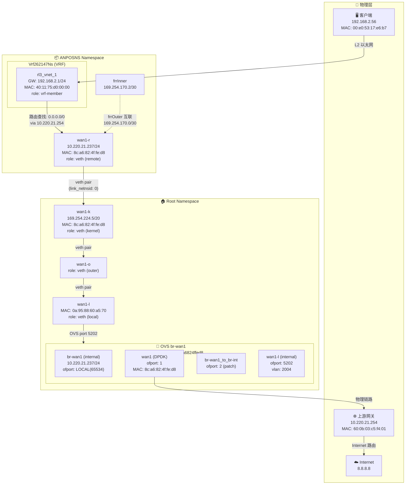
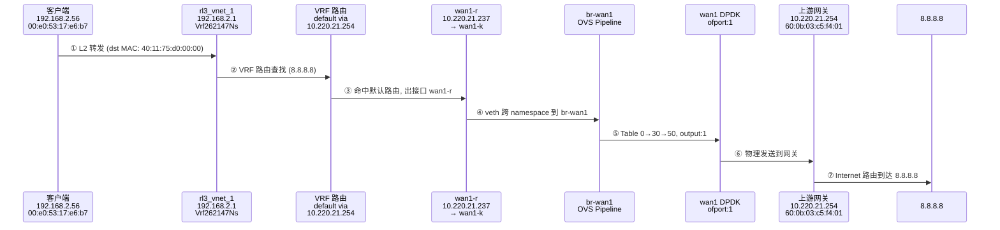

# FPE 流量链路图：192.168.2.56 → 8.8.8.8

## 网络拓扑总览



---

## 流量路径详细步骤

### 第 1 步：客户端发出数据包

| 属性 | 值 |
|------|-----|
| 源 IP | 192.168.2.56 |
| 源 MAC | 00:e0:53:17:e6:b7 |
| 目的 IP | 8.8.8.8 |
| 目的 MAC | 40:11:75:d0:00:00 (rl3_vnet_1, 网关) |

数据包通过 L2 网络到达 **rl3_vnet_1** (192.168.2.1/24)，该接口属于 **ANPOSNS/Vrf262147Ns**。

ARP 表确认客户端 MAC：
- 192.168.2.56 → 00:e0:53:17:e6:b7 (rl3_vnet_1, STALE)

### 第 2 步：VRF 路由查找

在 **Vrf262147Ns** 的主路由表中查找 8.8.8.8：

| 表 | 目标 | 下一跳 | 设备 | Metric |
|----|------|--------|------|--------|
| main | 0.0.0.0/0 | 10.220.21.254 | wan1-r | 80 |

命中默认路由，下一跳为 **10.220.21.254**，出接口为 **wan1-r**。

### 第 3 步：跨 Namespace (veth)

- **wan1-r** (ANPOSNS namespace, 10.220.21.237/24, MAC: 8c:a6:82:4f:fe:d8)
- 通过 veth pair 到达 **wan1-k** (Root namespace, 169.254.224.5/20)
- 继续通过 veth 链 → **wan1-o** → **wan1-l**
- **wan1-l** 接入 OVS **br-wan1** (ofport 5202, VLAN 2004)

### 第 4 步：OVS 流水线处理 (br-wan1)

数据包进入 br-wan1 后按以下流表处理：

```
Table 0  → Table 1  → Table 2  → Table 3
  (入口)    (CT/NAT)   (中转)     (协议分流/ACL)
    ↓
Table 3: in_port=5202 → output:1  (wan1 DPDK 物理口)
    ↓
Table 9  → Table 10 → Table 19 → Table 20
  (中转)    (QoS)      (中转)      (中转)
    ↓
Table 25 → Table 26 → Table 30
  (中转)    (NAT)      (L3 转发决策)
    ↓
Table 30: in_port=LOCAL → reg11=0x1
    ↓
Table 50: reg11=0x1 → output:1
```

- **Table 10** 命中 IP 普通流 → `set_queue:1000, resubmit(,19)` (507,868 packets 命中)
- **Table 30** 命中 LOCAL → `load:0x1→reg11[], resubmit(,50)` (517,588 packets 命中)  
- **Table 50** 最终: `output:1` → 发送到 DPDK 物理端口 **wan1**

### 第 5 步：物理出口

数据包从 OVS **wan1 (DPDK, ofport 1)** 发出到物理网络。

ARP 表已解析网关：
- 10.220.21.254 → 60:0b:03:c5:f4:01 (br-wan1, REACHABLE)

### 第 6 步：上游路由

网关 **10.220.21.254** (MAC: 60:0b:03:c5:f4:01) 接收数据包后，通过 Internet 路由到达最终目的地 **8.8.8.8**。

---

## 数据汇总



---

## 关键参数

| 项目 | 值 |
|------|-----|
| 客户端 IP | 192.168.2.56 |
| 客户端 MAC | 00:e0:53:17:e6:b7 |
| VRF | Vrf262147Ns (ANPOSNS) |
| 网关接口 | rl3_vnet_1 (192.168.2.1/24) |
| 默认路由 | 0.0.0.0/0 via 10.220.21.254 dev wan1-r |
| WAN IP | 10.220.21.237/24 |
| OVS 桥 | br-wan1 (DPID: 00008ca6824ffed8) |
| 物理出口 | wan1 (DPDK port 1), VLAN 2004 |
| 上游网关 | 10.220.21.254 (MAC: 60:0b:03:c5:f4:01) |
| OVS QoS | queue:1000 (默认 IP 队列) |
| 目标 | 8.8.8.8 |
