# 流量转发路径分析报告

**报文**: 192.168.2.56 (00:e0:53:17:e6:b7) → 8.8.8.8  
**协议**: ICMP（通用互联网出口）  
**分析时间**: 2026-05-26  
**报告置信度**: 高置信推断（br-int OVS 流表数据缺失，见[工具限制](#工具限制与未确认段)）

---

## 链路总图

```mermaid
flowchart TD
    CLIENT["客户端\n192.168.2.56\nMAC: 00:e0:53:17:e6:b7"]
    LAN["LAN 物理口\nlan1 / lan2 / lan4\nbr-int, VLAN 2000\n【推断: dpdk port】"]
    BRINT["br-int OVS 交换机\n【流表数据不可用: 推断 NORMAL 转发】"]
    LL3["ll3_vnet_1\nroot namespace veth\nbr-int, VLAN 2000"]
    RL3["rl3_vnet_1\n192.168.2.1/24\nANPOSNS / Vrf262147Ns\n【邻居 STALE ⚠️】"]
    L3_ANPO["ANPOSNS 内核 L3 路由\nrule 32766 → main table\n默认路由 via 10.220.21.254 dev wan1-r\nmetric 80"]
    WAN1R["wan1-r\n10.220.21.237/24\nANPOSNS veth\n→ 下一跳 10.220.21.254\nMAC: 60:0b:03:c5:f4:01 PERMANENT ⚠️"]
    WAN1K["wan1-k\n169.254.224.5/20\nroot namespace veth\n【wan1-r 的对端】"]
    L3_ROOT["root namespace 内核 L3\nSNAT + 路由\n→ via br-wan1 LOCAL"]
    BRWAN1_LOCAL["br-wan1 LOCAL 口\n(br-wan1 内核接口)\n10.220.21.237/24\n【dominant path: 711,856 pkts】"]

    subgraph BRWAN1 ["br-wan1 OVS 流表链（出向候选路径）"]
        T0["table 0  priority 0\nmatch: 全匹配\naction: resubmit(,1)\n【1,599,681 pkts】"]
        T1["table 1  priority 0\nmatch: 全匹配\naction: resubmit(,2)\n【954,709 pkts】"]
        T2["table 2  priority 0\nmatch: 全匹配\naction: resubmit(,3)\n【1,599,680 pkts】"]
        T3["table 3  priority 0\nmatch: 全匹配\naction: resubmit(,9)\n【718,105 pkts】"]
        T9["table 9  priority 0\nmatch: 全匹配\naction: resubmit(,10)\n【1,043,133 pkts】"]
        T10["table 10  priority 10\nmatch: ip\naction: set_queue:1000, resubmit(,19)\n【699,456 pkts】"]
        T19["table 19  priority 0\naction: resubmit(,20)\n【779,097 pkts】"]
        T20["table 20  priority 0\naction: resubmit(,25)\n【779,097 pkts】"]
        T25["table 25  priority 0\naction: resubmit(,26)\n【779,097 pkts】"]
        T26["table 26  priority 0\naction: resubmit(,30)\n【779,079 pkts】"]
        T30["table 30  priority 500\nmatch: in_port=LOCAL\naction: load reg11=0x1, resubmit(,50)\n【711,856 pkts】"]
        T50["table 50  priority 10\nmatch: reg11=0x1\naction: output:1\n【716,403 pkts ✅】"]
    end

    WAN1_DPDK["wan1  DPDK 物理口\nofport=1\nMAC: 8c:a6:82:4f:fe:d8\nVLAN tag: 2004\nbr-wan1"]
    UPSTREAM["上游运营商路由器\n下一跳 10.220.21.254\nMAC: 60:0b:03:c5:f4:01"]
    INTERNET["🌐 互联网 / 8.8.8.8"]

    CLIENT -- "目的 MAC: 40:11:75:d0:00:00\n(rl3_vnet_1 MAC)" --> LAN
    LAN --> BRINT
    BRINT -- "VLAN 2000 域 MAC 转发\n【推断候选流】" --> LL3
    LL3 -- "veth 对端" --> RL3
    RL3 --> L3_ANPO
    L3_ANPO --> WAN1R
    WAN1R -- "veth 对端\n穿越 namespace" --> WAN1K
    WAN1K --> L3_ROOT
    L3_ROOT --> BRWAN1_LOCAL
    BRWAN1_LOCAL --> T0
    T0 --> T1
    T1 --> T2
    T2 --> T3
    T3 --> T9
    T9 --> T10
    T10 --> T19
    T19 --> T20
    T20 --> T25
    T25 --> T26
    T26 --> T30
    T30 --> T50
    T50 --> WAN1_DPDK
    WAN1_DPDK --> UPSTREAM
    UPSTREAM --> INTERNET
```



---

## 最终结论

| 项目 | 内容 |
|------|------|
| **入口** | br-int 某 LAN 口 (lan1/lan2/lan4)，VLAN 2000 |
| **L3 网关** | rl3_vnet_1 (192.168.2.1)，ANPOSNS / Vrf262147Ns |
| **路由决策** | ANPOSNS main table，默认路由 0.0.0.0/0 via 10.220.21.254 dev wan1-r，metric 80 |
| **出口设备** | wan1（DPDK 物理口），通过 br-wan1 OVS 转发，ofport=1 |
| **OVS 决策流** | br-wan1: table 30 (in_port=LOCAL, reg11=0x1) → table 50 → output:1 |
| **上游下一跳** | 10.220.21.254，MAC 60:0b:03:c5:f4:01（PERMANENT） |
| **偏差点** | 当前证据未发现明显转发偏差 |
| **风险点** | 邻居 10.220.21.254 reachable=false；客户端邻居 192.168.2.56 状态 STALE |

---

## 置信度与证据层级

| 路径段 | 置信度 | 说明 |
|--------|--------|------|
| 客户端 → br-int LAN 口 | **推断** | br-int 流表工具返回空，依据拓扑 VLAN 域推断 |
| br-int → ll3_vnet_1 | **推断** | 同上，MAC 转发基于 VLAN 2000 域 |
| rl3_vnet_1 → ANPOSNS 内核路由 | **确认** | 接口 IP 192.168.2.1/24 + 邻居表 MAC 匹配 |
| 路由选择 default → wan1-r | **确认** | get_route + get_rule walk 直接返回 |
| wan1-r → wan1-k → root ns L3 | **推断** | veth 对端关系 + 接口 IP 验证 |
| br-wan1 LOCAL → table 50 → output:1 | **确认** | 流计数器活跃（711k→716k pkts），流 match/action 明确 |

---

## 逐跳证据

### 第一段：客户端 → br-int（推断候选流）

客户端 192.168.2.56（MAC `00:e0:53:17:e6:b7`）将帧发送至网关 MAC `40:11:75:d0:00:00`（rl3_vnet_1），帧从 lan1/lan2/lan4 中某个 LAN 口进入 br-int。

> **工具限制**：`fpe.get_ovs_flows(br-int)` 返回 0 条流，无法确认具体命中流。基于以下拓扑证据推断：
> - lan1、lan2、lan4 均为 br-int dpdk 口，VLAN tag 2000
> - ll3_vnet_1 为 br-int internal 口，VLAN tag 2000
> - rl3_vnet_1 MAC `40:11:75:d0:00:00` 已学习在同 VLAN 域

---

### 第二段：ANPOSNS 内核 L3 路由（确认）

**邻居表确认**（`fpe.get_neighbor`）：

```
ip:    192.168.2.56
dev:   rl3_vnet_1
mac:   00:e0:53:17:e6:b7
state: STALE   ⚠️  （已学习但需刷新）
ns:    ANPOSNS
```

**策略路由 rule walk**（`fpe.get_rule`）：

| 优先级 | 表 | 结果 |
|--------|----|------|
| 0 | local | 无 8.8.8.8 路由，不终止 |
| 1000 | [l3mdev-table] | 无 8.8.8.8 路由，不终止 |
| **32766** | **main** | **命中默认路由，终止** |

**生效路由**（`fpe.get_route`）：

```
prefix:  0.0.0.0/0
via:     10.220.21.254
dev:     wan1-r
metric:  80
table:   main
ns:      ANPOSNS (VRF: Vrf262147Ns)
```

**下一跳邻居**（`fpe.get_neighbor`）：

```
ip:    10.220.21.254
dev:   wan1-r (ANPOSNS / Vrf262147Ns)
mac:   60:0b:03:c5:f4:01
state: PERMANENT
reachable: false   ⚠️
```

> **风险说明**：PERMANENT 表示静态 ARP，MAC 存在故数据面转发不依赖动态 ARP 探测。`reachable=false` 由内核活性探测决定，可能是上游设备不响应 ICMP/ARP probe，但转发本身通常不受影响。建议在活跃流量期间验证对端实际可达性。

---

### 第三段：wan1-r → root namespace → br-wan1（推断 + 确认）

ANPOSNS 内核将报文从 wan1-r 发出。wan1-r 的 veth 对端为 root namespace 的 wan1-k（IP `169.254.224.5/20`）。root namespace 内核接收后，通过 br-wan1 接口（IP `10.220.21.237/24`）注入 br-wan1 OVS LOCAL 口。

---

### 第四段：br-wan1 OVS 流表链（确认候选流路径）

**入口**：LOCAL（br-wan1 内核接口，dominant path）

以下为候选流路径，基于 in_port=LOCAL 追踪（流计数器活跃）：

| 表 | 优先级 | match | action | 计数 |
|----|--------|-------|--------|------|
| 0 | 0 | `全匹配` | `resubmit(,1)` | 1,599,681 |
| 1 | 0 | `全匹配` | `resubmit(,2)` | 954,709 |
| 2 | 0 | `全匹配` | `resubmit(,3)` | 1,599,680 |
| 3 | 0 | `全匹配` | `resubmit(,9)` | 718,105 |
| 9 | 0 | `全匹配` | `resubmit(,10)` | 1,043,133 |
| 10 | **10** | `ip` | `set_queue:1000, resubmit(,19)` | **699,456** |
| 19 | 0 | `全匹配` | `resubmit(,20)` | 779,097 |
| 20 | 0 | `全匹配` | `resubmit(,25)` | 779,097 |
| 25 | 0 | `全匹配` | `resubmit(,26)` | 779,097 |
| 26 | 0 | `全匹配` | `resubmit(,30)` | 779,079 |
| 30 | **500** | `in_port=LOCAL` | `load:0x1→reg11, resubmit(,50)` | **711,856** |
| 50 | **10** | `reg11=0x1` | `output:1` | **716,403** |

> **table 10 说明**：ICMP 报文为 ip 类型，命中 `priority 10 ip` 流，赋予 queue 1000（默认 QoS），继续流水线。高优先级 pkt_mark 流（0x8/0x10/0x18 等）为 QoS 分级，不干扰此报文。

> **table 3 说明**：in_port=LOCAL 不触发 in_port=1（WAN 入向）的高优先级分类流，直接命中 priority 0 catch-all。

**最终出口**：`output:1` → **wan1 DPDK 物理口**（MAC `8c:a6:82:4f:fe:d8`，VLAN tag 2004）

---

## 工具限制与未确认段

| 不确定点 | 原因 | 影响 |
|----------|------|------|
| br-int 具体命中流 | `fpe.get_ovs_flows(br-int)` 返回空 | 无法确认 LAN→ll3_vnet_1 的具体 OVS 动作 |
| wan1-r → root ns 路由路径 | root namespace 路由未单独验证 | LOCAL 入口 dominant 计数间接确认 |
| br-int 是否有 DPI/DNS 旁路 | br-int 有 dpi_in_o/dpi_out_o/dns_in_o 等端口 | 不能排除部分流量在 br-int 被重定向 |

---

## 监控与验证指导

> 本报告基于快照数据，以下监控点应在活跃流量测试中验证。

### Level 1：转发决策关键点（最高优先级）

| 监控项 | 位置 | 预期信号 | 异常信号 |
|--------|------|----------|----------|
| br-wan1 table 30 `in_port=LOCAL` 流计数器 | br-wan1 OVS | 发包时计数递增 | 不增 → 报文未进入此流 |
| br-wan1 table 50 `reg11=0x1 output:1` 流计数器 | br-wan1 OVS | 发包时计数递增 | 不增 → 被前序表 DROP 或转向 |
| ANPOSNS main 表默认路由 via wan1-r | ANPOSNS namespace | 路由存在 metric=80 | 路由消失 → 无出口 |

### Level 2：路径连续性

| 监控项 | 位置 | 验证意义 |
|--------|------|----------|
| rl3_vnet_1 接收统计 | ANPOSNS namespace | 验证 br-int → ll3_vnet_1 交付 |
| wan1-r TX 统计 | ANPOSNS namespace | 验证路由决策后报文离开 ANPOSNS |
| wan1 DPDK 口 TX 统计 | root namespace | 验证最终出口发包 |

### Level 3：可达性

| 监控项 | 关注点 |
|--------|--------|
| 邻居 10.220.21.254 on wan1-r (Vrf262147Ns) | PERMANENT MAC 存在，但 reachable=false，建议 ping 验证 |
| 邻居 192.168.2.56 on rl3_vnet_1 (STALE) | 回包时若需要 ARP，STALE 会触发探测；长时间无流量后回包可能延迟 |

---

## 风险汇总

| 风险编号 | 风险描述 | 严重度 | 建议 |
|----------|----------|--------|------|
| R1 | 下一跳 10.220.21.254 邻居 `reachable=false` | 中 | 确认上游设备在线；检查是否应答 ARP/ping |
| R2 | 客户端邻居 192.168.2.56 状态 `STALE` | 低 | 活跃流量会自动刷新；长时间空闲后首包可能微延迟 |
| R3 | br-int OVS 流表不可见 | 低（工具限制） | 在设备上直接运行 `ovs-ofctl dump-flows br-int` 验证 |
| R4 | wan2/wan3/wan4 路由备份状态未知 | 低 | 确认其他 WAN 口路由 metric，评估 WAN1 故障时切换能力 |
