# 流量转发路径分析报告 v2

**报文**：192.168.2.56 (MAC: 00:e0:53:17:e6:b7) → 8.8.8.8  
**协议**：ICMP（通用互联网出口）  
**分析时间**：2026-05-26  
**分析方法**：OVS-first 原始工具追踪（fpe.get_ovs_flows + fpe.get_ovs_bridges + fpe.get_route + fpe.get_neighbor）

---

## 链路总图（候选路径）

```mermaid
flowchart TD
    CLIENT["客户端\n192.168.2.56\nMAC: 00:e0:53:17:e6:b7"]

    subgraph BR_INT["br-int OVS 交换机（L3 offload）\ndatapath_id: 0000fefefefefefe"]
        T0["Table 0  pri=10\nmatch: in_port=8\naction: tun_id=0x1, metadata=0x8004000300000001, goto_table:2\n【Confirmed 753 pkts】"]
        T2_9["Tables 2→3→4→6→7→8→9\nmatch: 全匹配 (priority=0)\naction: 逐跳 goto_table:N+1\n【Confirmed ~877 pkts】"]
        T10["Table 10  pri=1\nmatch: ip\naction: goto_table:13\n【Candidate 130 pkts】"]
        T13_28["Tables 13→20→23→28\nmatch: 全匹配（src/dst不匹配本地前缀）\naction: 逐跳 goto_table\n【Candidate】"]
        T30["Table 30  pri=40  ⭐ per-client 确认流\nmatch: in_port=8, dl_src=00:e0:53:17:e6:b7\naction: goto_table:40\n【Confirmed 636 pkts】"]
        T40_45["Table 40  pri=0  →  Table 45  pri=0\nmatch: 全匹配（dst=8.8.8.8 不匹配本地）\naction: goto_table:45 → goto_table:50\n【Candidate ~996 pkts】"]
        T50["Table 50  pri=30  ⭐ 网关 MAC 命中\nmatch: metadata=0x8000000000000001/0x8000000000ffffff\n        dl_dst=40:11:75:d0:00:00（网关 MAC）\naction: tun_id=0x40003, goto_table:70\n【Confirmed 6 pkts】"]
        T70["Table 70  pri=0\naction: goto_table:80\n【Confirmed 93 pkts】"]
        T80["Table 80  pri=10  ⭐ L3 路由决策\nmatch: ip\naction: dec_ttl, reg8=0x4, group:570425351\n【Confirmed 78 pkts】"]
        GRP["Group 570425351\n【Unconfirmed - tool 无法读取】\n推断: 选择 WAN1, set reg11=0x4\ncontinue to table 85"]
        T85_139["Tables 85→90→100→110→120→125→128→129→131→135→139\n全匹配 passthrough 链\n【Candidate 94 pkts】"]
        T140["Table 140  pri=30  ⭐ SNAT\nmatch: ip, reg11=0x4, metadata=0x4000300000000/0xffffff00000000\naction: ct(commit,zone=12293,nat(src=10.220.21.237))\n【Confirmed 63 pkts】"]
        T141_150["Tables 141→143→145→150\npassthrough"]
        T150["Table 150  pri=10  ⭐ 出口决策\nmatch: reg11=0x4\naction: output:4（patch → br-wan1）\n【Confirmed 63 pkts】"]
    end

    PATCH_BR_INT["br-int_to_br-wan1 patch\n（ofport=4，inferred）\n↕\nbr-wan1_to_br-int patch\n（ofport=2 in br-wan1，inferred）"]

    subgraph BR_WAN1["br-wan1 OVS 交换机\ndatapath_id: 00008ca6824ffed8"]
        W0_9["Tables 0→1→2→3→9\nmatch: 非 LOCAL, 非 in_port=1\naction: 逐跳 resubmit\n【Candidate ~747K pkts via pri=0】"]
        W10["Table 10  pri=10\nmatch: ip\naction: set_queue:1000, resubmit(,19)\n【Candidate ~727K pkts】"]
        W19_26["Tables 19→20→25→26\n全匹配 passthrough\naction: resubmit(,30)\n【Candidate ~810K pkts】"]
        W30["Table 30  pri=500\nmatch: in_port=2（patch 来向）\naction: reg11=0x1, resubmit(,50)\n【Candidate 4,679 pkts】"]
        W50["Table 50  pri=10  ⭐ 最终出口\nmatch: reg11=0x1\naction: output:1\n【Confirmed 745,335 pkts】"]
    end

    WAN1["wan1 DPDK 物理口\nofport=1, MAC: 8c:a6:82:4f:fe:d8\nVLAN tag: 2004"]
    UPSTREAM["上游运营商路由器\n10.220.21.254\nMAC: 60:0b:03:c5:f4:01 (PERMANENT ⚠️ reachable=false)"]
    INTERNET["🌐 互联网 / 8.8.8.8"]

    CLIENT -- "ingress: lan1\nofport=8, VLAN 2000\ndl_dst=40:11:75:d0:00:00（网关 MAC）" --> T0
    T0 --> T2_9
    T2_9 --> T10
    T10 --> T13_28
    T13_28 --> T30
    T30 --> T40_45
    T40_45 --> T50
    T50 --> T70
    T70 --> T80
    T80 -- "group:570425351\n【Unconfirmed】" --> GRP
    GRP --> T85_139
    T85_139 --> T140
    T140 --> T141_150
    T141_150 --> T150
    T150 --> PATCH_BR_INT
    PATCH_BR_INT --> W0_9
    W0_9 --> W10
    W10 --> W19_26
    W19_26 --> W30
    W30 --> W50
    W50 --> WAN1
    WAN1 --> UPSTREAM
    UPSTREAM --> INTERNET
```



---

## 最终结论

| 项目 | 内容 | 置信度 |
|------|------|--------|
| **入口** | br-int LAN 口 lan1（DPDK, ofport=8, VLAN 2000） | Confirmed |
| **per-client 识别** | Table 30 per-client MAC 流：in_port=8, dl_src=00:e0:53:17:e6:b7 | Confirmed |
| **L3 转发模式** | OVS L3 offload（br-int 内部路由，不经内核 namespace） | Confirmed（流计数活跃） |
| **L3 路由决策** | Table 80 pri=10 ip → group:570425351（WAN 选择） | Confirmed flow，group Unconfirmed |
| **SNAT** | Table 140：src SNAT → 10.220.21.237（WAN1 IP）zone 12293 | Confirmed |
| **出口** | Table 150 output:4 → patch → br-wan1 → Table 50 output:1 → wan1 | Confirmed（输出口） |
| **上游下一跳** | 10.220.21.254，MAC 60:0b:03:c5:f4:01（PERMANENT） | Confirmed（neighbor 表） |
| **偏差点** | 当前证据未发现明显转发偏差 | — |
| **主要风险** | 上游邻居 reachable=false；Group 570425351 数据缺失 | 中 / 低 |

---

## 置信度与证据层级

| 路径段 | 置信度 | 依据 |
|--------|--------|------|
| 客户端帧进入 br-int lan1 (in_port=8) | **Confirmed** | Table 0 in_port=8，753 pkts，flow 活跃 |
| 通过 per-client MAC 流 (Table 30) | **Confirmed** | dl_src=00:e0:53:17:e6:b7，636 pkts，MAC 精确匹配 |
| 网关 MAC 命中 Table 50 pri=30 | **Confirmed** | dl_dst=40:11:75:d0:00:00，6 pkts，flow match 明确 |
| OVS L3 路由 Table 80 ip → group:570425351 | **Confirmed flow，group Unconfirmed** | 78 pkts，group dump-groups 工具返回空 |
| Group 570425351 选择 WAN1 (reg11=0x4) | **Inferred** | Table 140/150 reg11=0x4 有活跃计数（63 pkts）反向推断 |
| Table 140 SNAT → 10.220.21.237 | **Confirmed** | ip,reg11=0x4，ct nat(src=10.220.21.237)，63 pkts |
| Table 150 output:4 → patch to br-wan1 | **Confirmed** | reg11=0x4，63 pkts；patch 端口 ofport=4 为 inferred |
| br-wan1 patch (in_port=2) → output:1 | **Confirmed output** | Table 50 reg11=0x1 output:1，745K pkts；in_port=2 ofport 为 inferred |
| wan1 → 上游 10.220.21.254 | **Confirmed** | neighbor PERMANENT MAC 60:0b:03:c5:f4:01 |

---

## 逐跳证据

### Hop 1：客户端 → br-int lan1（Confirmed）

客户端 192.168.2.56 (MAC `00:e0:53:17:e6:b7`) 将帧发往网关 MAC `40:11:75:d0:00:00`（192.168.2.1 的 ARP 应答 MAC），经物理 LAN 口 lan1 进入 br-int。

**br-int Table 0 命中流**（Confirmed，753 pkts）：

```
table=0, priority=10, in_port=8
actions=set_field:0x1->tun_id,
        write_metadata:0x8004000300000001/0x80ffffffffffffff,
        goto_table:2
```

- `in_port=8` = lan1（DPDK 物理口，MAC 8c:a6:82:4f:fe:da，VLAN tag 2000）
- metadata 写入：bit63=1（下行），bits[55..48]=0x04，bits[39..32]=0x03 → VLAN/VRF 标识

---

### Hop 2：br-int Tables 2→9，passthrough（Confirmed）

Tables 2、3、4、6、7、8、9 均只有 priority=0 全匹配流，依次 goto_table，包计数约 877 pkts。无分类逻辑。

---

### Hop 3：br-int Table 10，IP 分类（Candidate，130 pkts）

```
table=10, priority=1, match=ip
actions=goto_table:13
```

ICMP 属于 IP 类型，命中此流进入 L3 处理路径（130 pkts）。非 IP/IPv6 流量走 priority=0 → goto_table:28，绕过 L3 路径。

---

### Hop 4：br-int Table 30，per-client 学习流（Confirmed，636 pkts）⭐

```
table=30, priority=40, send_flow_rem
match=metadata=0x8000000000000001/0x8000000000ffffff,
      in_port=8, dl_src=00:e0:53:17:e6:b7
actions=goto_table:40
```

这是针对本客户端 MAC (`00:e0:53:17:e6:b7`) 和 in_port=8 的精确匹配流，636 pkts 活跃。`send_flow_rem` 表示控制器安装的 per-session 流（老化后通知控制器）。

经过 Table 40 (priority=0 → goto_table:45) 和 Table 45 (priority=0 → goto_table:50)，包流向 Table 50。

---

### Hop 5：br-int Table 50，网关 MAC 识别与 L3 路由分发（Confirmed，6 pkts）⭐

```
table=50, priority=30
match=metadata=0x8000000000000001/0x8000000000ffffff,
      dl_dst=40:11:75:d0:00:00
actions=set_field:0x40003->tun_id, goto_table:70
```

客户端帧的目的 MAC `40:11:75:d0:00:00` 是 192.168.2.1 网关的 MAC（由 Table 50 priority=200 的 ARP 应答流确认）。此流将 tun_id 更新为 0x40003 并进入 L3 路由流水线。

> **注意**：Table 50 priority=70 专门处理 ARP（588 pkts → output:10 至 ll3_vnet_1/ANPOSNS）；IP/ICMP 命中 priority=30（6 pkts）走 OVS L3 offload 路径。

---

### Hop 6：br-int Table 80，L3 路由决策 + Group（Confirmed flow，Unconfirmed group）⭐

经 Table 70 (priority=0 → goto_table:80) 后：

```
table=80, priority=10, match=ip
actions=dec_ttl,
        set_field:0x4->reg8,
        move:NXM_OF_IN_PORT[]->NXM_NX_REG9[0..15],
        set_field:0->in_port_oxm,
        group:570425351
```

- `dec_ttl`：TTL -1（L3 路由行为）
- `group:570425351`：WAN 出口选择组（78 pkts）

> **Group 570425351 数据缺失**：`fpe.get_ovs_groups` 工具对 br-int DPDK 桥同样受 OpenFlow 版本限制，返回空。根据 Table 140/150 的 reg11=0x4 反向推断：组选择 WAN1，执行 `set_field:0x4->reg11` 并继续流水线至 Table 85。

高优先级流（pri=742 nw_dst=192.168.2.1，pri=234 nw_dst=192.168.2.0/24）均不匹配 dst=8.8.8.8，确认命中 pri=10。

---

### Hop 7：br-int Tables 85→140，SNAT（Confirmed，63 pkts）⭐

Tables 85→90→100→110→120→125→128→129→131→135→139 均为 priority=0 passthrough 链（约 94 pkts）。

**Table 140 SNAT 命中流**（Confirmed，63 pkts）：

```
table=140, priority=30
match=ip, reg11=0x4, metadata=0x4000300000000/0xffffff00000000
actions=load:0x1->NXM_NX_PKT_MARK[8..15],
        ct(commit, table=141, zone=12293,
           nat(src=10.220.21.237),
           exec(set_field:0x40003->ct_mark))
```

- `nat(src=10.220.21.237)`：SNAT 为 WAN1 IP 地址
- `ct_mark=0x40003`：conntrack 标记，用于回包识别
- 完全在 OVS 内部完成，无需内核 namespace

---

### Hop 8：br-int Table 150，出口（Confirmed，63 pkts）⭐

经 Tables 141→143→145→150：

```
table=150, priority=10, match=reg11=0x4
actions=output:4
```

output:4 = patch 端口 `br-int_to_br-wan1`（ofport=4，inferred；patch 口 ofport 工具无法读取）。

---

### Hop 9：br-wan1 OVS，出口流水线（Candidate → Confirmed output）

流量从 patch 口 `br-wan1_to_br-int` 进入 br-wan1。根据 br-wan1 Table 30 流证据，该 patch 口 inferred ofport=2。

**Table 30 命中流**（Candidate，4,679 pkts）：

```
table=30, priority=500, match=in_port=2
actions=load:0x1->NXM_NX_REG11[], resubmit(,50)
```

> Table 30 in_port=LOCAL（740,657 pkts）为内核 L3 路径（ANPOSNS → wan1-r → wan1-k → br-wan1 LOCAL），主要承载 TCP 等需要 kernel conntrack 的流量。in_port=2（4,679 pkts）为 OVS L3 offload 路径，对应本报文。

**Table 50 出口**（Confirmed，745,335 pkts）：

```
table=50, priority=10, match=reg11=0x1
actions=output:1
```

output:1 = wan1（DPDK 物理口，ofport=1，MAC `8c:a6:82:4f:fe:d8`，VLAN tag 2004）。

---

### Hop 10：wan1 → 上游运营商（Confirmed）

```
wan1 (ofport=1, br-wan1)
  → 上游 10.220.21.254
  → MAC 60:0b:03:c5:f4:01 (PERMANENT, reachable=false ⚠️)
```

**ANPOSNS 内核路由（参考，用于 kernel L3 fallback 路径）**：

```
default via 10.220.21.254 dev wan1-r metric 80 (main table, ANPOSNS)
```

---

## 风险汇总

| 编号 | 描述 | 严重度 | 建议 |
|------|------|--------|------|
| **R1** | 上游邻居 10.220.21.254 `reachable=false`（PERMANENT 静态 ARP） | **中** | 确认上游设备在线；静态 ARP 不依赖动态探测，但物理可达性需验证 |
| **R2** | Group 570425351 数据不可见 | **中** | 直接在设备执行 `ovs-ofctl -O OpenFlow13 dump-groups br-int` 确认 WAN 选择逻辑；若存在多 WAN 负载均衡，需验证 WAN1 bucket 是否 active |
| **R3** | patch 端口 ofport（br-int_to_br-wan1 / br-wan1_to_br-int）工具显示 null | **低（工具限制）** | 直接执行 `ovs-ofctl -O OpenFlow13 show br-int` 和 `ovs-ofctl -O OpenFlow13 show br-wan1` 确认实际 ofport |
| **R4** | 客户端邻居 192.168.2.56（ANPOSNS）状态 STALE（ARP 回包路径） | **低** | 活跃流量会自动刷新；首包可能有微延迟 |

---

## 监控与验证指导

> 本报告基于快照数据，以下监控点应在活跃流量测试中验证。

### Level 1：转发决策关键点（最高优先级）

| 监控项 | 位置 | 预期信号 | 异常含义 |
|--------|------|----------|----------|
| br-int Table 30 `in_port=8,dl_src=00:e0:53:17:e6:b7` 计数器 | br-int OVS | 发包时 n_packets 递增 | 不增 → 客户端帧未进入 br-int 或 MAC 变更 |
| br-int Table 80 `ip` (group:570425351) 计数器 | br-int OVS | 发包时递增 | 不增 → Table 50 未将流量引入 L3 路径 |
| br-int Table 140 `ip,reg11=0x4` SNAT 计数器 | br-int OVS | 发包时递增 | 不增 → group:570425351 未选择 WAN1（reg11≠0x4） |
| br-int Table 150 `reg11=0x4` output:4 计数器 | br-int OVS | 发包时递增 | 不增 → NAT 前被丢弃 |
| br-wan1 Table 50 `reg11=0x1` output:1 计数器 | br-wan1 OVS | 发包时递增 | 不增 → patch 入口匹配失败 |

**验证命令（在设备上执行）**：

```bash
# br-int 流表关键计数器
ovs-ofctl -O OpenFlow13 dump-flows br-int table=30 | grep "dl_src=00:e0:53:17:e6:b7"
ovs-ofctl -O OpenFlow13 dump-flows br-int table=80
ovs-ofctl -O OpenFlow13 dump-flows br-int table=140
ovs-ofctl -O OpenFlow13 dump-flows br-int table=150

# br-int group 详情（当前工具不可用，需直接执行）
ovs-ofctl -O OpenFlow13 dump-groups br-int 570425351
ovs-ofctl -O OpenFlow13 dump-group-stats br-int 570425351

# br-wan1 出口确认
ovs-ofctl -O OpenFlow13 dump-flows br-wan1 table=50

# patch 口 ofport 确认
ovs-ofctl -O OpenFlow13 show br-int | grep -E "patch|br-int_to"
ovs-ofctl -O OpenFlow13 show br-wan1 | grep -E "patch|br-wan1_to"
```

### Level 2：路径连续性

| 监控项 | 位置 | 验证意义 |
|--------|------|----------|
| br-int Table 50 `dl_dst=40:11:75:d0:00:00` 计数器 | br-int OVS | 确认网关 MAC 识别，流量进入 L3 routing |
| br-wan1 Table 30 `in_port=2` 计数器 | br-wan1 OVS | 确认 OVS L3 offload 流量到达 br-wan1（patch 路径） |
| wan1 TX 统计（ifstat/ovs-vsctl） | 设备物理口 | 确认最终出口发包 |

### Level 3：可达性

| 监控项 | 位置 | 关注点 |
|--------|------|--------|
| 邻居 10.220.21.254 on wan1-r（ANPOSNS） | ANPOSNS namespace | PERMANENT 静态 ARP 存在，但 reachable=false；在线时转发不受影响，但建议 `ping -I wan1-r 10.220.21.254` 验证 |
| Group 570425351 bucket 活跃状态 | br-int OVS | 若为 ff（fast-failover）类型，需确认 watch_port 对应的 WAN 口为 UP |

---

## 工具限制与未确认段

| 不确定点 | 原因 | 影响 | 建议验证方式 |
|----------|------|------|--------------|
| Group 570425351 buckets | `fpe.get_ovs_groups` 对 DPDK 桥使用默认 OpenFlow 1.0，返回空 | 无法确认 WAN 选择逻辑（ECMP/failover/单路） | `ovs-ofctl -O OpenFlow13 dump-groups br-int 570425351` |
| br-int_to_br-wan1 ofport | patch 口无 MAC，`ovs-ofctl show` 不列出 | output:4 的目标 patch 口推断 | `ovs-ofctl -O OpenFlow13 show br-int` |
| br-wan1_to_br-int ofport | 同上 | table 30 in_port=2 为 patch 的推断 | `ovs-ofctl -O OpenFlow13 show br-wan1` |
| br-int 可能存在的 DPI/镜像路径 | detect(ofport=5301) / dpi_in_o / dpi_out_o 端口存在 | 不能排除部分流量在 br-int 被 DPI 处理 | 检查 Table 42/61 相关流计数器 |

---

*本报告基于快照数据，不代表实时状态。上述 Level 1 监控点应在活跃测试流量期间验证，以确认推断路径的实际准确性。*
