# 转发路径分析报告

**流量**: 192.168.2.56 (MAC: 00:e0:53:17:e6:b7) → 8.8.8.8  
**协议**: TCP / 目的端口 80  
**分析时间**: 2026-05-26  
**置信度**: 高（OVS 候选命中链 + 内核路由已确认；group bucket 已通过 MCP 工具展开）

---

## 一、最终路径结论

```
观察路径（Inferred）：

客户端 192.168.2.56
  └─[lan1 / ofport=8, VLAN 2000]──► br-int
       └─ table0  prio10   in_port=10 → set reg1=0x1, tun_id=0x1, metadata, goto_table:2
       └─ table2  prio0    all        → goto_table:3
       └─ table3  prio0    all        → goto_table:4
       └─ table4  prio0    all        → goto_table:6
       └─ table6  prio0    all        → goto_table:7
       └─ table7  prio0    all        → goto_table:8
       └─ table8  prio0    all        → goto_table:9
       └─ table9  prio0    all        → goto_table:10
       └─ table10 prio45000 ct_state=+est → goto_table:13  [OVS_COLD_FLOW]
       └─ table13 prio0    all        → goto_table:20
       └─ table20 prio0    all        → goto_table:23      [新连接，非 +trk]
       └─ table23 prio0    all        → goto_table:28
       └─ table28 prio0    all        → goto_table:30
       └─ table30 prio25   metadata=0xc000.../0xc000... → goto_table:40
       └─ table40 prio0    all        → goto_table:45
       └─ table45 prio0    all        → goto_table:50
       └─ table50 prio0    all        → goto_table:60
       └─ table60 prio0    all        → goto_table:61
       └─ table61 prio6    metadata=0x8000...0001/... → meter:1, group:1342177280, group:1342177281, goto_table:62
                                                         group:1342177280 (type=all, 广播泛洪): output:7,8,9,10
                                                         group:1342177281 (type=all, 0 buckets): 空
       └─ table70 prio0    all        → goto_table:80      [另一路径分支]
       └─ table80 prio10   ip         → dec_ttl, set reg8=0x4, group:570425351
                                         group:570425351 (type=select, ECMP 出口):
                                           bucket0: eth_src=02:0c:29:a3:9b:6d, eth_dst=00:b1:b1:b1:b1:b1 → wwan1 方向
                                           bucket1: eth_src=8c:a6:82:4f:fe:d8, eth_dst=60:0b:03:c5:f4:01 → wan1 方向（上游网关）

  ──► ANPOSNS / Vrf262147Ns 内核 L3
       └─ 规则 prio0   → local 表（无命中，8.8.8.8 非本地）
       └─ 规则 prio1000 → l3mdev 表（无命中）
       └─ 规则 prio32766 → main 表 → 命中默认路由
              default via 10.220.21.254 dev wan1-r metric 80

  ──► wan1-r（ANPOSNS 侧）→ veth pair → wan1-k（root namespace）
       └─ br-wan1（OVS bridge，IP: 10.220.21.237/24）
              └─ 物理出口 wan1（通过 br-wan1 patch/port）
                   └─ 下一跳 10.220.21.254（ARP 状态: PERMANENT，MAC: 60:0b:03:c5:f4:01）

  ──► 互联网 → 8.8.8.8
```

---

## 二、Mermaid 链路图

```mermaid
flowchart TD
    CLIENT["客户端\n192.168.2.56\nMAC: 00:e0:53:17:e6:b7"]
    LAN1["br-int 入口\nll3_vnet_1 / ofport=10\nVLAN tag=2000"]

    T0["table0 prio10\nmatch: in_port=10\nactions: set reg1=0x1, tun_id=0x1\nwrite_metadata, goto_table:2\n[Confirmed, n_packets=11]"]

    T2_9["table2→9\n各表 prio0 all\ngoto_table:下一表\n[Confirmed, n_packets≈899]"]

    T10["table10 prio45000\nmatch: ct_state=+est\nactions: goto_table:13\n[Candidate, n_packets=0 COLD]"]

    T13["table13 prio0\nmatch: all\nactions: goto_table:20\n[Confirmed, n_packets=188]"]

    T20["table20 prio0\nmatch: all (新连接非+trk)\nactions: goto_table:23\n[Confirmed, n_packets=88]"]

    T23["table23 prio0\nmatch: all\nactions: goto_table:28\n[Confirmed, n_packets=88]"]

    T28["table28 prio0\nmatch: all\nactions: goto_table:30\n[Confirmed, n_packets=900]"]

    T30["table30 prio25\nmatch: metadata=0xc000.../0xc000...\nactions: goto_table:40\n[Candidate, n_packets=3]"]

    T40["table40 prio0\nmatch: all\nactions: goto_table:45\n[Confirmed, n_packets=1022]"]

    T45["table45 prio0\nmatch: all\nactions: goto_table:50\n[Confirmed, n_packets=1023]"]

    T50["table50 prio0\nmatch: all\nactions: goto_table:60\n[Confirmed, n_packets=6]"]

    T60["table60 prio0\nmatch: all\nactions: goto_table:61\n[Confirmed, n_packets=0]"]

    T61["table61 prio6\nmatch: metadata=0x8000...0001/...\nactions: meter:1\ngroup:1342177280\ngroup:1342177281\ngoto_table:62\n[Confirmed, n_packets=160]"]

    GRP1["group:1342177280\ntype=all (广播泛洪)\nbucket0: output:7 (lan2)\nbucket1: output:8 (lan1)\nbucket2: output:9 (lan4)\nbucket3: output:10 (ll3_vnet_1)\n[Confirmed]"]
    GRP2["group:1342177281\ntype=all\n0 buckets (空)\n[Confirmed]"]

    T80["table80 prio10\nmatch: ip\nactions: dec_ttl, set reg8=0x4\ngroup:570425351\n[Confirmed, n_packets=78]"]

    GRP3["group:570425351\ntype=select (ECMP)\nbucket0: eth_dst=00:b1:b1:b1:b1:b1 → wwan1\nbucket1: eth_dst=60:0b:03:c5:f4:01 → wan1 (上游网关)\n[Confirmed]"]

    KERNEL["ANPOSNS / Vrf262147Ns\n内核 L3 路由查找"]

    RULE["规则 prio32766\n→ main 表\neffective_rule 命中"]

    ROUTE["默认路由\ndefault via 10.220.21.254\ndev wan1-r metric 80\n[Confirmed]"]

    WANR["wan1-r\nANPOSNS 侧 veth\nIP: 10.220.21.237/24"]

    BRWAN1["br-wan1\nroot namespace OVS bridge\nIP: 10.220.21.237/24"]

    NH["下一跳 10.220.21.254\nMAC: 60:0b:03:c5:f4:01\nARP state: PERMANENT\n[Confirmed]"]

    INTERNET["互联网\n8.8.8.8"]

    CLIENT --> LAN1
    LAN1 --> T0
    T0 --> T2_9
    T2_9 --> T10
    T10 --> T13
    T13 --> T20
    T20 --> T23
    T23 --> T28
    T28 --> T30
    T30 --> T40
    T40 --> T45
    T45 --> T50
    T50 --> T60
    T60 --> T61
    T61 --> GRP1
    T61 --> GRP2
    T61 --> T80
    T80 --> GRP3
    GRP3 --> KERNEL
    KERNEL --> RULE
    RULE --> ROUTE
    ROUTE --> WANR
    WANR --> BRWAN1
    BRWAN1 --> NH
    NH --> INTERNET
```



---

## 三、逐跳证据表

| 跳序 | 位置 | 对象 | match | actions | 置信度 | n_packets |
|------|------|------|-------|---------|--------|-----------|
| 1 | root ns | ll3_vnet_1 ofport=10 | 入口接口 | 进入 br-int | Confirmed | — |
| 2 | br-int | table0 prio10 cookie=0xef | in_port=10 | set reg1=0x1, tun_id=0x1, write_metadata, goto_table:2 | Confirmed | 11 |
| 3 | br-int | table2 prio0 cookie=0x2 | all | goto_table:3 | Confirmed | 903 |
| 4 | br-int | table3 prio0 cookie=0x101 | all | goto_table:4 | Confirmed | 899 |
| 5 | br-int | table4 prio0 cookie=0xd | all | goto_table:6 | Confirmed | 899 |
| 6 | br-int | table6 prio0 cookie=0x1b | all | goto_table:7 | Confirmed | 899 |
| 7 | br-int | table7 prio0 cookie=0x1c | all | goto_table:8 | Confirmed | 899 |
| 8 | br-int | table8 prio0 cookie=0x1d | all | goto_table:9 | Confirmed | 899 |
| 9 | br-int | table9 prio0 cookie=0x1e | all | goto_table:10 | Confirmed | 899 |
| 10 | br-int | table10 prio45000 cookie=0x24 | ct_state=+est | goto_table:13 | Candidate (COLD) | 0 |
| 11 | br-int | table13 prio0 cookie=0x9d | all | goto_table:20 | Confirmed | 188 |
| 12 | br-int | table20 prio0 cookie=0x31 | all (非+trk) | goto_table:23 | Confirmed | 88 |
| 13 | br-int | table23 prio0 cookie=0x33 | all | goto_table:28 | Confirmed | 88 |
| 14 | br-int | table28 prio0 cookie=0x42 | all | goto_table:30 | Confirmed | 900 |
| 15 | br-int | table30 prio25 cookie=0x45 | metadata=0xc000.../0xc000... | goto_table:40 | Candidate | 3 |
| 16 | br-int | table40 prio0 cookie=0x4c | all | goto_table:45 | Confirmed | 1022 |
| 17 | br-int | table45 prio0 cookie=0x64 | all | goto_table:50 | Confirmed | 1023 |
| 18 | br-int | table50 prio0 cookie=0x5b | all | goto_table:60 | Confirmed | 6 |
| 19 | br-int | table60 prio0 cookie=0x80 | all | goto_table:61 | Confirmed | 0 |
| 20 | br-int | table61 prio6 cookie=0xdf | metadata=0x8000...0001/... | meter:1, group:1342177280, group:1342177281, goto_table:62 | Confirmed | 160 |
| 21 | br-int | table80 prio10 cookie=0x15a | ip | dec_ttl, set reg8=0x4, group:570425351 | Confirmed | 78 |
| 22 | ANPOSNS | 规则 prio32766 | from all | lookup main | Confirmed | — |
| 23 | ANPOSNS | 路由 main 表 | 0.0.0.0/0 | via 10.220.21.254 dev wan1-r metric 80 | Confirmed | — |
| 24 | root ns | br-wan1 | — | 出口 OVS bridge | Confirmed | — |
| 25 | root ns | 下一跳 10.220.21.254 | — | MAC: 60:0b:03:c5:f4:01, PERMANENT | Confirmed | — |

---

## 四、置信度与未解决缺口

| 项目 | 状态 | 说明 |
|------|------|------|
| OVS 入口 table0 命中 | Confirmed | n_packets=11，in_port=10 精确匹配 |
| table2~9 透传链 | Confirmed | 各表 prio0 all，计数器活跃 |
| table10 ct_state=+est | Candidate | n_packets=0，新连接首包不命中此流，应走 table10 其他流或直接 fallthrough |
| table20 新连接路径 | Confirmed | prio0 goto_table:23，n_packets=88 |
| table30 metadata 匹配 | Candidate | metadata 值需运行时验证 |
| table61 group:1342177280/1342177281 | Confirmed | group:1342177280 type=all 广播泛洪 output:7,8,9,10；group:1342177281 type=all 空 bucket |
| table80 group:570425351 | Confirmed | type=select 2 buckets：bucket1 eth_dst=60:0b:03:c5:f4:01 确认 wan1 出口 |
| 内核路由 wan1-r → 10.220.21.254 | Confirmed | get_route 直接返回 |
| 下一跳 ARP | Confirmed | PERMANENT，MAC 60:0b:03:c5:f4:01 |
| br-wan1 出口 | Inferred | wan1-r veth pair 对端为 br-wan1 OVS bridge |

---

## 五、风险提示

| 风险码 | 严重度 | 说明 |
|--------|--------|------|
| OVS_COLD_FLOW | medium | table10 prio45000 (ct_state=+est) n_packets=0，新连接首包走其他路径 |
| OVS_TABLE_LOOP | high | analyze_flow 检测到 table20 resubmit loop（ct_clear → resubmit(0,20)），实际新连接绕过此流 |
| GROUP_RESOLVED | info | group:570425351 (select, 2 buckets) 和 group:1342177280 (all, 4 buckets) 已确认；出口端口 wan1 方向 eth_dst=60:0b:03:c5:f4:01 |
| NEIGHBOR_PERMANENT | info | 10.220.21.254 ARP 为 PERMANENT 静态条目，不会自动刷新 |

---

## 六、监控与验证指引

### Level 1：转发决策点（最高优先级）

| 监控点 | 位置 | 预期信号 | 验证含义 |
|--------|------|----------|----------|
| table80 prio10 flow counter | br-int | 发包时 n_packets 递增 | 流量进入默认路由出口 group |
| table61 prio6 flow counter | br-int | n_packets 递增 | 流量经过 group:1342177280/1342177281 |
| 路由 main 表 default via wan1-r | ANPOSNS/Vrf262147Ns | 路由条目存在 | 内核 L3 出口有效 |

### Level 2：路径连续性

| 监控点 | 位置 | 预期信号 |
|--------|------|----------|
| table0 prio10 in_port=10 counter | br-int | 入口流量计数递增 |
| table20 prio0 counter | br-int | 新连接透传计数 |
| wan1-r 接口 TX 计数 | ANPOSNS | 出口字节递增 |
| br-wan1 接口 TX 计数 | root ns | 物理出口字节递增 |

### Level 3：可达性

| 监控点 | 位置 | 预期信号 |
|--------|------|----------|
| 邻居 10.220.21.254 状态 | ANPOSNS wan1-r | PERMANENT / REACHABLE |
| br-wan1 IP 10.220.21.237 可达性 | root ns | ping 10.220.21.254 有响应 |

### 验证命令参考

```bash
# 查看 table80 prio10 计数
ovs-ofctl -O OpenFlow13 dump-flows br-int table=80 | grep "cookie=0x15a"

# 查看 group:570425351 bucket
ovs-ofctl -O OpenFlow13 dump-groups br-int 570425351

# 查看 group:1342177280 / 1342177281 bucket
ovs-ofctl -O OpenFlow13 dump-groups br-int 1342177280
ovs-ofctl -O OpenFlow13 dump-groups br-int 1342177281

# 验证内核路由（ANPOSNS namespace）
ip netns exec ANPOSNS ip route show vrf Vrf262147Ns

# 验证邻居
ip netns exec ANPOSNS ip neigh show dev wan1-r
```

> 本报告基于快照数据，非实时监控。上述验证点应在实际流量测试期间同步观测，以确认推断路径。

---

## 七、接口与拓扑说明

| 接口 | 所在位置 | 角色 | IP / MAC |
|------|----------|------|----------|
| ll3_vnet_1 | root ns, br-int ofport=10 | LAN 侧 veth（OVS 内部） | MAC: 0e:5f:9c:3e:74:0f |
| rl3_vnet_1 | ANPOSNS / Vrf262147Ns | LAN 网关接口 | 192.168.2.1/24, MAC: 40:11:75:d0:00:00 |
| wan1-r | ANPOSNS / Vrf262147Ns | WAN 出口（namespace 侧） | 10.220.21.237/24 |
| wan1-k | root ns | WAN veth（kernel 侧） | 169.254.224.5/20 |
| wan1-l | root ns | WAN veth（link 侧） | — |
| br-wan1 | root ns OVS bridge | WAN OVS bridge | 10.220.21.237/24 |
| 下一跳 | root ns | 上游网关 | 10.220.21.254, MAC: 60:0b:03:c5:f4:01 |
